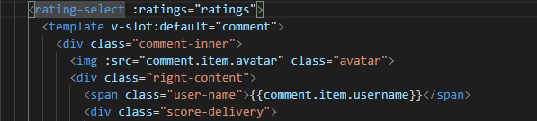
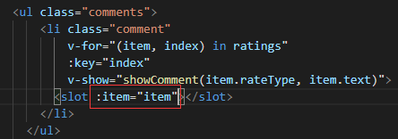

### vue 组件间的信息传输

#### 父子传值 (props + 自定义事件)
  - 通过props传递, 可以传递任何数据类型, 不只是属性, methods 中定义的函数也可以传递给子组件
  - 初始化时父组件数据(对象类型)还未传过来会导致控制台报错(不影响最终的效果)  
  方案一: 设置与数据类型匹配的默认值; 方案二: 使用v-if=”数据”, 拿到数据才渲染  
  - 自定义事件的传参问题  
    父组件接收子组件自定义事件时, 如果只接收子组件携带的参数, 那么就不写(), 否则报错; 如果要自定义参数, 加上(参数)即可, 如果两个参数都要, ($event, 参数)即可  
  
####  $root, $parent, $children

#### ref $refs
ref 和 class 不一样, 它只在当前 "作用域" 有用, 也就是说子组件元素的 ref 父组件是无法获取的. 如果一个子组件元素上有 ref, 而在父组件用了很多次, 在子组件中通过 ref 只能获取到"激活"(focus 状态) 的 input 元素.  
ref 可以用在组件上, 也可以用在元素上, 用在组件上时获取到组件实例, 用在元素上获取到元素. 当使用 v-for 渲染多个拥有相同 ref 的组件/元素的时候, 获取到包含所有组件/元素的数组; 而如果不是 v-for 渲染, 而是手写, 只能获取最后一个组件/元素

  
#### 事件总线 (非父子关系)
  ```js  
  //vue 原型链挂载总线 
  Vue.prototype.$bus = new Vue()
  // 发送
  this.$bus.$emit("eventName",value); 
  //接收
  mounted(){
    this.$bus.$on("eventName", value =>{ })
  }
  //解绑，否则会 $on 会多次执行 -- 事件总线, 给 window 添加的方法, 定时器, 等等, 全局的东西不会随着组件销毁而销毁, 所以要手动去除  
  mounted(){
    this.$bus.$off("eventName") // this.$bus.$on 前面加上
    this.$bus.$on("eventName", value =>{ })
  }
  //或  --  beforDestroy 钩子里
  beforDestroy(){
    this.$bus.$off("eventName") 
  }
  //或  --  通过 hook 监听组件销毁钩子函数，并取消监听事件
  mounted(){    
    this.$once('hook:beforeDestroy', () => {
      window.removeEventListener('resize', this.$_handleResizeChart)
    })
  }
  ```

#### provide/ inject
```js
//祖先
export default {
  name: "A",
  provide: {
    for: "demo"
  }
}
//后代
export default {
  name: "C",
  inject: ['for']
}
```
- provide和inject不是响应式的，这点很重要，除非申明的属性是响应式的！

#### vue. observer

#### 插槽

- 匿名插槽: 一个子组件中只能有一个, 在父组件中填入的内容会填充(不需要根标签)  

- 具名插槽: 可以有多个, 可与匿名插槽共存
```js
<template v-slot:header>
  <h1>Here might be a page title</h1>
</template>
```
  - 一个不带 name 的插槽出口会带有隐含的名字“default”
  - 新的插槽写法: v-slot:default=”scope” (旧写法: slot=”name” slot-scope=”scope”)

- 作用域插槽
父级模板里的所有内容都是在父级作用域中编译的；子模板里的所有内容都是在子作用域中编译的。  
在子组件中留了插槽, 在父组件中用内容填充插槽, 插槽内容是无法访问子组件的数据的, 简单粗暴一点说, 就是写在哪里就访问哪里的数据, 否则就能靠传

*数据的话, 写在哪里就用哪里的, 但是css样式, 写在哪儿都可以, 写在子组件里也行, 写在父组件里也行(注意: 子组件插槽部分的 class 样式可以写在子组件里, 也可以写在父组件里; 子组件的 class 样式只能写在子组件里, 但是class名还是可以在父组件里用, 作为插槽 class 的父级)*

```js
//父组件
<template v-slot:default="scope">
  <span>{{scope.item}}</span>
</template>

//子组件
<slot :item="item"></slot>
//或
<slot v-bind="{ item: 4 }"></slot>
```

这个其实有点像父子组件传值, 通过在标签上传递数据给内容区展示; 只是子组件接收数据放在了 props 属性中, 而插槽内容接收数据放在 scope 对象中; 可以传递的值包括他”正常”可以访问的值, 也就是如果他不是插槽, 一般元素可以访问的值: 包括 dom 中的数据以及 data, props, computed 中的数据

*有没有发现, dom元素会构成”作用域”, 典型的以v-for循环li标签为例, 每一个li标签和它的后代们形成一个”域”, 标签之间无法互相访问对方的数据*

[official docs]Inside v-for blocks we have full access to parent scope properties.
是说 li 的子元素可以访问 item 的内容的意思吗? 而这是我之前体会到的, 我真哒太棒鸟吧!!!

**与v-for循环一起用**  
如循环一个列表, 每个 li 标签渲染的数据都不一样, item 每次传递的值都不一样

*在循环中是生成了很多个同名插槽吗? 模板只有一个哦*

  

 
**小用法--默认值**  
有时为一个插槽设置具体的后备 (也就是默认的) 内容是很有用的，它只会在没有提供内容的时候被渲染。
```js
<button type="submit">
  <slot>Submit</slot>
</button>
```


#### $attrs, inheritAttrs, $listeners (爷孙/嵌套)

https://juejin.im/post/5c76ab5e5188257c1e2c8ea6

#### vuex (全体共享数据的)状态管理工具


### 数据流动
一个公有组件用在两个地方, 是创建了两个备份, 这两个备份之间毫无关联, 数据不共通不共享
要做到他们之间数据的同步, 除非他们使用的是一个对象类型数据, 他们的操作只改变其中的值. 一个数据在很多地方都需变更, 并需要同步的即时的结果, 它最好是对象的属性, 可以把这个对象通过传递和复制在很多地方使用, 作为引用类型, 都指向一个对象, 这个特性实在是太好用了