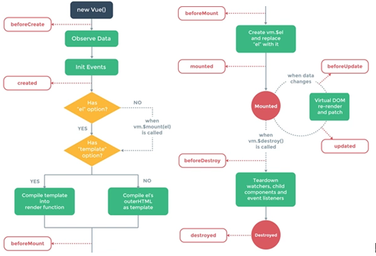

## 生命周期

### 单组件生命周期
#### beforeCreate --> created
观察 data 数据和初始化事件, 也就是数据和 methods 里的函数已经被包含入 vue 实例对象之中, 经验也证明了写在前面的函数可以调用写在后面的函数

### created()
dom 尚不存在于实例对象中，为 undefined，通过 this.$el 不可获取；初始数据可获取

### 父子组件的生命周期触发顺序