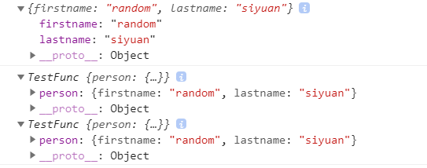
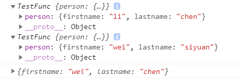

> vue 是人为的, 是一份 js 文件, 所有的内容都是 js 知识

#### 两个数组相等的情况

有数组 A, 基于数组 A 渲染 input/checkbox (label 包裹); data 中定义数组 B, 与循环渲染出的各项通过 v-model 绑定
如果所有选项都被选上, 此时 A == B, 为什么呢

#### 单独打印属性值没有, 打印对象却有
```
console.log(this.queryInfo.word) //空
console.log(this.queryInfo) //打开对象看却是有值的...why
this.queryInfo.word = this.currentWord   
console.log(this.queryInfo.word) //有值
console.log(this.queryInfo)  //有值
```

#### 为什么 Vue 中一个组件的 data 选项必须是一个函数

https://vuejs.org/v2/guide/components.html#data-Must-Be-a-Function

**尝试还原情景: 一个构造函数, 传入相同参数, 创建多个实例**
<!-- vue 的子组件应该是 Vue.extends() 构建的, 和创造插件的情况一样, 这个之后研究了再补充 -->
##### 使用对象时 
```js
const myself = {
  firstname: 'wei',
  lastname: 'chen'
}
function TestFunc(obj){
  this.person = obj
}
const instance1 = new TestFunc(myself)
const instance2 = new TestFunc(myself)
instance1.person.firstname = 'li'
instance2.person.lastname = 'siyuan'
myself.firstname = 'random'
console.log(myself)
console.log(instance1, instance2)
```
打印结果如下:  


由上图可以看出, myself, instance1.person, instance2.person 指向的是同一个对象, 一变都会变. 根本原因是 js 对于对象是传引用的   
同样地, 如果 Vue 中组件的 data 选项是对象, 那么实例 $data 指向的是同一个对象
<!-- ; 也因此, new Vue() 中可以使用对象, 因为根实例只有一个 -->

##### 使用函数时
```js
function myself(){
  return {
    firstname: 'wei',
    lastname: 'chen'
  }
}
function TestFunc(func){
  this.person = func()
}
const instance1 = new TestFunc(myself)
const instance2 = new TestFunc(myself)
instance1.person.firstname = 'li'
instance2.person.lastname = 'siyuan'  
console.log(instance1, instance2)
console.log(myself())
```
打印结果如下:  


由上图可以看出, 通过函数生成了不同的对象, 属性的改变不会再互相影响
```js
function myself(){
  return {
    firstname: 'wei',
    lastname: 'chen'
  }
}
const obj1 = myself()
const obj2 = myself()
console.log(obj1 == obj2) //false
```

Vue-组件的data属性为什么必须是函数？ https://axiu.me/coding/why-vue-component-data-must-be-function/