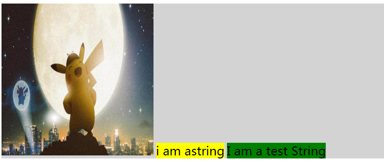
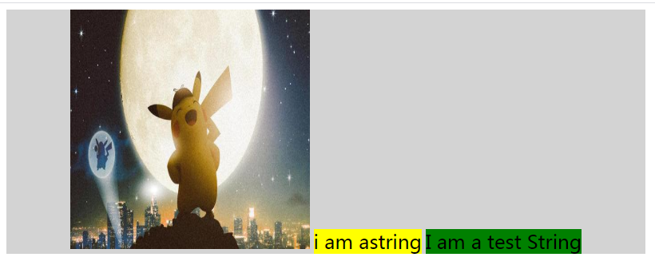
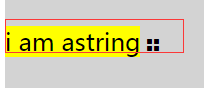

> 对齐涉及的元素级别: 块级; 行内级

### 行内级元素的对齐  (元素级别与元素类型共同影响了对齐 )
- 对齐方向: 水平、垂直  
- 对齐的两个属性: text-align vertical-align (vertical-algin的默认值是baseline, baseline 使元素的基线与父元素的基线对齐(父元素的基线似乎是位于最底部的元素的基线)。没有基线的元素，使用外边距的下边缘替代。)  
- 垂直对齐时会产生影响的属性: line-height (行高通过影响影响基线简洁影响对齐; 该设置的优先级低于 vertical-align, 也就是两个条件只能满足其一的时候满足 vertical-align)  
- 涉及的元素级别: 行内级; 行内块级  
- 涉及的元素类型: 图片/无文字(inline-block)、文字、图标字体(默认inline, 可设置inline-block; 兼具图片和字体的特色, 在展示和其他元素交互上是图片, 而在设置颜色和字体大小方面像字体)  
**涉及到基线的时候情况会比较复杂, 尽量避免**

初始情况下: 一个图片img; 两个inline span; 一个inline 字体图标(i元素)
文本本应该在顶部, 但是图片底部需要对齐baseline, 图片没法再往上走, 于是只好文字往下移动

第一问: text-align 是否可以对齐inline-block元素  
答案: 可以  

第二问: line-height==height 是否可以对齐 inline-block 元素  
答案: 不可以, 该设置只能够让单行文字, 在 block 框中居中对齐, 而且是有条件的  
  - 字体图标和文字一起时, 字体图标没有基线, 下边与文字baseline对齐, 不能居中; 并且同图片一样, 它的初始位置也是下移的, 没有挨着顶部(取决于 font-size 设置--即使没有真实的文本, 也存在基线;  font-size 为 0 的时候, 是挨着的, 也能够居中)  
     

第三问: 一个块级元素包含行内块 span 元素 A B, 若这两个元素都含有文本, 它们会互相影响吗?
答案: 会, 初始字体是一样的, 在加大一方字体后, 另一方会整体下移; 这是因为他们都是块级元素内的行内元素, 他们将与该块级元素的基线对齐, 而这个基线估计是位置最低的文本的基线 (移动优先下移, 也是比较合理的)

### 块级元素的对齐  (简单的多, 方式也很多)

  
