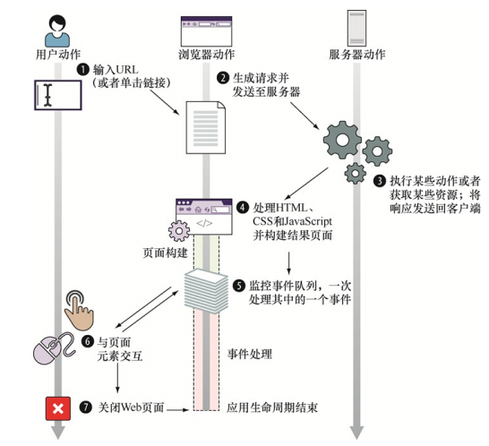

### JavaScript 忍者秘籍
#### 第一章
除了精通 JavaScript 语言以外，还需要具有以下特质：
- 调试技巧  
  浏览器开发者工具
- 测试  
  断言函数
```js
assert（condition, message）;
//第一个参数是一个应为真值的条件，第二个参数是当断言为假时所展示的一句话。
```

- 性能分析
```js
console.time("My operation"); //开始计时器
for(var n = 0; n < maxCount; n++){
/*perform the operation to be measured*/
} //执行多次操作
console.timeEnd("My operation"); //停止计时器
```

##### 模型—视图—控制器（Model—View—Controller, MVC）框架

#### 第二章
典型客户端 Web 应用的生命周期从用户在浏览器地址栏输入一串 URL，或单击一个链接开始。


在第 4 步的页面构建中, 包括两个部分: 解析 HTML 并构建 DOM; 执行 js 代码  (这两个步骤一直交替执行)
在页面构建阶段，浏览器会遇到特殊类型的 HTML 元素 —— 脚本元素，该元素用于包括 js 代码。每当解析到脚本元素时，浏览器就会停止从 HTML 构建 DOM，并开始执行 JavaScript 代码。一旦脚本执行完毕, 浏览器便会重新构建 DOM, 如此反复.

执行JavaScript代码
浏览器通过全局对象提供了一个API 使JavaScript引擎可以与之交互并改变页面内容。  
浏览器暴露给JavaScript 引擎的主要全局对象是window对象，它代
表了包含着一个页面的窗口。window对象是获取所有其他全局对象、
全局变量（甚至包含用户定义对象）和浏览器API的访问途径。全局
window对象最重要的属性是document，它代表了当前页面的DOM。通
过使用这个对象，JavaScript代码就能在任何程度上改变DOM，包括修
改或移除现存的节点，以及创建和插入新的节点。

在第 5 步的事件处理中, 
浏览器使用单线程执行模型, 同一时刻只能执行一个代码片段，即所谓的单线程执行模型。
浏览器使用了事件队列，所有已生成的事件（无论是用户生成的，例如鼠标移动或键盘按
压，还是服务器生成的，例如Ajax事件）都会放在同一个事件队列中，以它们被浏览器检测到的顺序排列。


- 浏览器事件，例如当页面加载完成后或无法加载时；
- 网络事件，例如来自服务器的响应（Ajax事件和服务器端事件）；
- 用户事件，例如鼠标单击、鼠标移动和键盘事件；
- 计时器事件，当timeout时间到期或又触发了一次时间间隔。


代码的提前建立是为了在之后的某个时间点执行。除了全局代码，
页面中的大部分代码都将作为某个事件的结果执行。


##### script 标签的位置: 为什么 script 标签一般放在 body 下面
https://www.jianshu.com/p/86250c123e53

按照HTML5标准中的HTML语法规则，如果在后再出现或任何元素的开始标签，都是 parse error，浏览器会忽略之前的，即视作仍旧在 body 内。

把 script 脚本放在 html 结束标签外会怎么样
效果等同于放在 body 中的尾部 ...

自己页面审查元素,虽然你把 script 标签放在 body 之外,但是解析结果是在body的尾部...
把在 head 中不支持的元素放在 head ,结果一样会渲染在 body 的头部 ... 
都是为了防止这种不规范的操作出现错误的渲染结果

##### 浏览器内核: 渲染引擎和 JS 引擎
渲染引擎负责负责对网页语法的解释（如HTML、XML等）并渲染网页（CSS）。渲染引擎决定了浏览器如何显示网页的内容以及页面的格式信息。
JavaScript引擎是一个专门处理JavaScript脚本的虚拟机，一般会附带在网页浏览器之中。即负责对JavaScript脚本的解释与执行。
渲染引擎和JS引擎是互斥的(不会同时运行)
如果在页面构建过程中, script 标签不是写在 body 尾部, 而 js 脚本中出现了死循环, 页面将无法全部渲染出来

#### 第三章
JavaScript中最关键的概念是：函数是第一类对象（first-class objects），或者说它们被称作一等公民（first-class citizens）。函数与对象共存，函数也可以被视为其他任意类型的JavaScript对象。函数与其他对象共存，并且能够像任何其他对象一样地使用。函数可以通过字面量创建，可以赋值给变量，可以作为函数参数进行传递，甚至可以作为返回值从函数中返回。

JavaScript中对象可通过字面量来创建 {}。对象可以赋值给变量、数组项，或其他对象的属性。

```js
var ninja = {}; //为变量赋值一个新对象
ninjaArray.push（{}）; //向数组中增加一个新对象
ninja.data = {}; //给某个对象的属性赋值为一个新对象

function hide（ninja）{
ninja.visibility = false;
}
hide（{}）; //对象作为参数传递给函数

function returnNewNinja（） {
return {}; //对象作为函数的返回值
}

var ninja = {};
ninja.name = "Hanzo"; //对象能够具有动态创建和分配的属性。
```
其实，不同于很多其他编程语言，在JavaScript中，我们几乎能够用
函数来实现同样的事。
对象能做的任何一件事，函数也都能做。函数也是对象，唯一的特
殊之处在于它是可调用的（invokable），即函数会被调用以便执行某项
动作。

对象作为参数传递给函数: 
对于函数而言，这项特性也表明：如果我们将某个函数作为参数传入另一个函数，
传入函数会在应用程序执行的未来某个时间点才执行。大家所知道的更一般的概念是回调函数（callback function）。
每当我们建立了一个将在随后调用的函数时，无论是在事件处理阶
段通过浏览器还是通过其他代码，我们都是在建立一个回调
（callback）。这个术语源自于这样一个事实，即在执行过程中，我们
建立的函数会被其他函数在稍后的某个合适时间点“再回来调用”。
有效运用JavaScript的关键在于回调函数，相信你已经在代码中使用
了很多回调函数——不论是单击一次按钮、从服务端接收数据，还是UI
动画的一部分。
