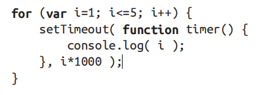
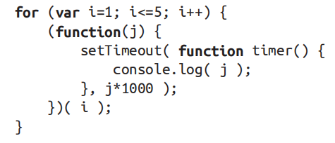
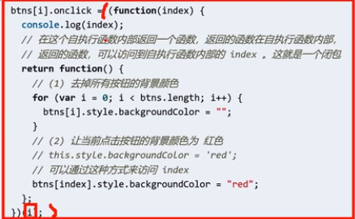

### 闭包
#### 闭包是什么, 是如何形成的
**闭包是指有权访问另一个函数作用域中的变量的函数. 创建闭包的常见方式, 就是在一个函数内部创建另一个函数**  
&emsp;&emsp;根据变量访问规则, 定义在函数内部的函数是无法在外部访问到的, 只有当这个函数的外层函数被调用的时候它才会执行, 也就是它一般是在定义位置执行的; 根据函数调用规则, 函数调用是会形成执行上下文, 出现调用栈, 函数会一层层压入调用栈, 然后一个个弹出, 同时执行上下文一个个销毁, 执行完了就完了.  
&emsp;&emsp;但是在有些情况下, 它会在非定义位置执行, 而又需要访问定义位置作用域链上的变量, 这些变量会被保留下来供他使用, 不会被销毁, 此之谓闭包  
*(此时函数的外层函数必定执行过一次, 要不然这些函数乖乖放在那里, 什么也没有发生, 也就无法对这个函数进行操作(return 出去或者赋值或者传参), 而在做这些操作的时候, 系统发现有些变量还会用到(还存在引用), 便没有销毁, 于是闭包自然而然形成的)*
<!-- 从头开始捋, 就会发现闭包产生的过程是自然而然的, 是符合逻辑的, 也就是我之前一直说的, 并无特别之处, 而对这个的认知从特别到不特别的过程经过了两个月, 所以重要概念先接触的思路是对的 -->
<!-- 闭包 为什么不垃圾回收 本来函数一层层执行到里面 是很正常的 内层函数可以自然拿到父层的变量 但是里面有个函数保存到别的地方要到别的地方调用了 当它调用的时候肯定不可能把它的父层函数执行一遍把里面的变量创建一遍吧 那么当系统发现这个保存出去的函数有用到已经创建的变量 以后还要用 就不销毁了 这是一种很负责任的机制啊 不管娃仔你在哪里 爸爸的钱都给你用 -->

##### 如何在非定义位置执行函数
**函数内部: 函数体内, 也就是 {} 内, 包括 return 后的内容和另一个函数的参数**
1. 在函数 A 的 return 后接函数 B 定义;
2. 在全局作用域中声明一个变量, 并将定义在某函数之内的函数赋值给这个变量;
3. 传参  
    A 函数内部执行 setInterval, 函数 B 作为 setInterval 的参数 (setInterval 为全局函数, 也就是 B 函数是在全局下的一个函数内执行)  

递归也符合非定义位置执行, 但不会形成闭包

(谷歌浏览器中) 在非定义位置执行的函数在执行时如果需要访问其所定义位置的上级作用域中的属性,则会形成闭包。闭包为属性所在函数, 一次可能产生多个闭包.

#### 实例辨析一
**在下面的循环中, i 无法依次打印 12345，因为 i 是公用的。此时可以通过立即执行函数创建闭包，让每次执行时 i都拥有私有的值。**



立即执行函数: 声明一个函数，并马上调用这个匿名函数就叫做立即执行函数  
对象的属性值如果是立即执行函数, 这个立即执行函数会执行, 结果赋予属性; 这就和变量赋值是一样的, 先执行等号右边的语句, 然后赋值, 语句执行和正常时候一样

**循环执行了五次, 生成五个一样的函数, 五个不一样的闭包**

  

**这种方法可以用于循环为多个元素绑定事件时**

  

(引入块级作用域之后, 就不必如此麻烦了)

#### 实例辨析二
##### (第二条规则适用, 但比较隐晦)
```js
var num = '我是全局变量 num'
function fn(){
  var num = '我是 window > fn 私有变量 num'
  fn = function(){
    console.log(num);    
  }
}
fn()
fn()
```
在上面的例子中, 第一次 fn() 的时候, 执行了一次对 fn 的赋值操作, 根据变量赋值的规则, 本级作用域没有, 向上找, 找到了 window 下的fn于是, 原来的函数地址被替换; 第二次 fn() 的时候, 执行的是函数
```js
function(){
  console.log(num);    
}
```
它的结果是 '我是 window > fn 私有变量 num' 也就是形成了闭包, 它保存到了定义的函数之外, 从 fn 中到了window 里

#### 实例辨析三
```js
function foo(){
  var length = 4
  return {
    info: function(){
      console.log(length)
    }
  }
}
const result = foo()
result.info() //4
```
外层函数即使 return 一个对象出去, 对象的属性值是一个函数, 这个函数都可以访问到外层函数的属性  
return 后接的语句, 能执行的语句是会执行的, 比如打印语句和立即执行函数; 如果 return 的是打印语句 用变量来接收函数, 依然返回 undefined  
关于length, 数组/伪数组的 length 是包含的项目; 字符串的 length 是它包含的 character; 数字类型没有这个说法; 函数对象的 length 是形参的数量


在chrome开发者工具中观察函数调用栈、作用域链与闭包: https://www.jianshu.com/p/73122bb3d262
