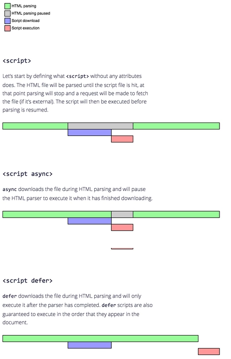
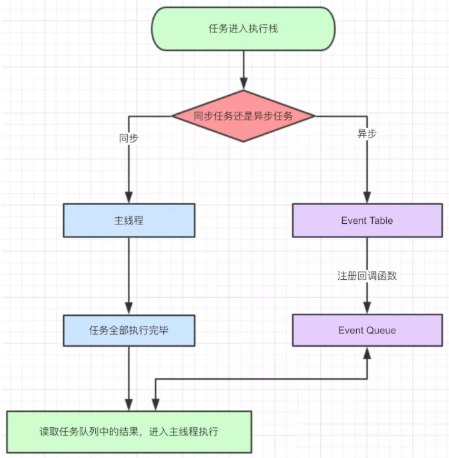
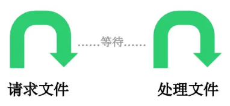
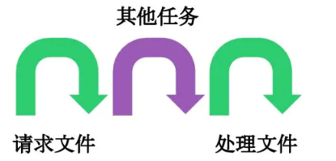
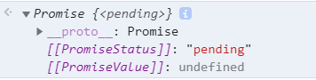
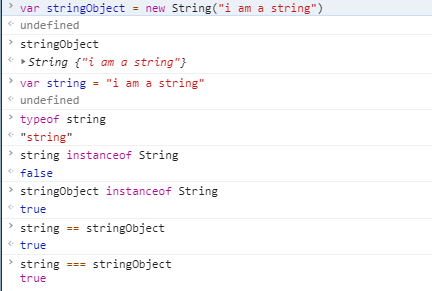
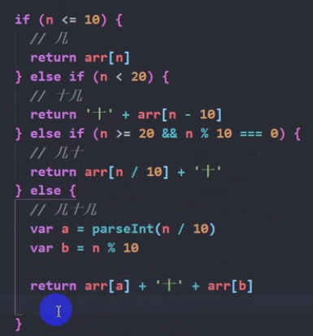

# js 执行机制

JavaScript 是一门单线程语言 (浏览器只给 js 引擎分配了一个线程), 也就是说同一时间只能做一件事(执行一条语句)。这是因为 JavaScript 生来作为浏览器脚本语言，主要用来处理与用户的交互、网络以及操作 DOM。这就决定了它只能是单线程的，否则会带来很复杂的同步问题。假设 JavaScript 有两个线程，一个线程在某个 DOM 节点上添加内容，另一个线程删除了这个节点，这时浏览器应该以哪个线程为准？

但是, 又确实有些事情是比较费时间的, 如果一直等着, 太耽误事. 怎样做才能尽可能地提高效率呢? 既然一次只能做一件事情, 那么肯定是要进行排队的, 要优化, 也只能在这上面做文章. Event Loop 就是一种 "排队" 的机制: 一次放进去一批任务, 其他的等第二轮 [宏任务]; 在当前一批任务里, 依次执行, 遇到有问题的, 拉到一边, 处理完了, 就在旁边等着, 等其他正常的过完了, 再放过去 [微任务].

## js 代码的引入
- \<script>  标签中间直接书写代码
- \<script> 标签引入外部文件
  - src 属性指定外部脚本的 URI， 如果设置了 src 特性，script 标签内容将会被忽略
  - async 属性
  - defer 属性

  

## 严格模式
通过在脚本文件/函数开头添加 "use strict"; 声明，即可启用严格模式。

## 执行环境/执行上下文

执行环境（execution context）是 JavaScript 中最为重要的一个概 念。执行环境定义了变量或函数有权访问的其他数据，决定了它们各自的行为。  
每个执行环境都有一个与之关联的变量对象（variable object），环境中定义的所有变量和函数都保存在这个对象中。虽然我们编写的代码无法访问这个对象，但解析器在处理数据时会在后台使用它。  
全局执行环境是最外围的一个执行环境。在 Web 浏览器中，全局执行环境被认为是 window 对象，因此所有全局变量和函数都是作为 window 对象的属性和方法创建的。某个执行环境中的所有代码执行完毕后，该环境被销毁，保存在其中的所有变量和函数定义也随之销毁（全局执行环境直到应用程序退出——例如关闭网页或浏览器——时才会被销毁）。  
每个函数都有自己的执行环境。当执行流进入一个函数时，函数的环境就会被推入一个环境栈中。 而在函数执行之后，栈将其环境弹出，把控制权返回给之前的执行环境。  
当代码在一个环境中执行时，会创建变量对象的一个作用域链（scope chain）。作用域链的用途，是保证对执行环境有权访问的所有变量和函数的有序访问。作用域链的前端，始终都是当前执行的代码所在环境的变量对象。如果这个环境是函数，则将其活动对象（activation object）作为变量对象。活动对 象在最开始时只包含一个变量，即 arguments 对象（这个对象在全局环境中是不存在的）。作用域链中的下一个变量对象来自包含（外部）环境，而再下一个变量对象则来自下一个包含环境。这样，一直延续到全局执行环境；全局执行环境的变量对象始终都是作用域链中的最后一个对象。 (高程三)

深入探讨JavaScript的执行环境和栈: https://blog.csdn.net/tangxiaolang101/article/details/52087239?utm_source=blogxgwz5

### 执行上下文类型
全局执行上下文
函数执行上下文
Eval 函数执行上下文

### 执行上下文栈/调用栈
具有 LIFO（后进先出）结构，用于存储在代码执行期间创建的所有执行上下文。

深入理解JavaScript执行上下文和执行栈: https://juejin.im/post/5c77365c6fb9a049b2228e4a

解密 JavaScript 执行上下文: https://juejin.im/post/5cda8c8051882569223af63d

### 作用域/词法环境/词法作用域  
作用域是访问变量(包括函数名)的一套规则  
作用域与变量声明和函数定义位置有关, 层层嵌套, 内部可以访问外部, 外部不可访问内部, 访问变量时一层层往上找, 找到就停下, 到底了也找不到就会报引用错误;  
变量赋值时也是一层层往上找, 找到就地赋值, (严格模式下) 找不到报引用错误; (非严格模式下) 这个变量会成为window的属性  
无论是否严格模式, 在全局声明的变量是 window 的属性; 在全局定义的函数, 是 window 的方法  

#### 全局作用域
#### 函数作用域
#### 块级作用域
块级作用域的子块级作用域可以访问父级的变量以及重新赋值, 但是如果子级声明同名变量, 其实是两个变量, 子级会使用自己的变量; 这和 var 是一样的

## Event Loop



### 任务分类一: 同步与异步
同步任务: 连续的执行，就叫做同步; 等待的时候就是傻等，不同时做别的事情

异步任务: 一个任务分成两段，先执行第一段，然后转而执行其他任务，等做好了准备，再回过头执行第二段。排在异步任务后面的代码，不用等待异步任务结束会马上运行，也就是说，异步任务不具有”堵塞“效应。


### 任务分类二: 宏任务与微任务
宏任务: script(主代码); setTimeout; setInterval  
微任务: Promise 的 then/catch 函数, Promise为基础开发的其它技术, 如 fetch API

**除了主代码, setTimeout, setInterval, Promise 都是异步任务**
代码开始执行时, 整体代码为宏任务, 将其中的微任务拿出来, 在本轮执行; 将其中的宏任务拿出来, 放到下一轮执行; 下一轮到来, 又一个整体宏任务, 循环开始...  
除了最开始的宏任务, 其他的宏任务, 微任务均为异步任务; 将不能立刻完成的任务变成异步任务, 避免阻塞, 正是由 js 的单线程特质决定的.

这一次，彻底弄懂 JavaScript 执行机制: https://juejin.im/post/59e85eebf265da430d571f89#comment

总结：JavaScript异步、事件循环与消息队列、微任务与宏任务: https://juejin.im/post/5be5a0b96fb9a049d518febc

### 异步编程
#### 回调函数
A callback is a function that is passed as an argument to another function and is executed after its parent function has completed.

回调函数只是一个称呼，表达的含义是将函数 A 作为函数 B 的参数，并且函数 A 在函数 B 内进行调用, 此时 B 称为高阶函数。

因为异步的时候我们不能一直等待，因此需要一个函数来在异步操作执行完了以后，继续接下来的顺序操作。
回调函数可以实现异步编程, 但并不是所有回调函数都是异步的; 只有当回调函数在异步任务完成后触发, 此时它才是异步的

*你到一个商店买东西，刚好你要的东西没有货，于是你在店员那里留下了你的电话，过了几天店里有货了，店员就打了你的电话，然后你接到电话后就到店里去取了货。在这个例子里，你的电话号码就叫回调函数，你把电话留给店员就叫登记回调函数，店里后来有货了叫做触发了回调关联的事件，店员给你打电话叫做调用回调函数，你到店里去取货叫做响应回调事件。*

##### 问题
回调地狱: 如果某个业务，依赖于上层业务的数据，上层业务又依赖于更上一层的数据，采用回调的方式来处理异步的话，就会出现回调地狱。

#### 事件监听
这种方式下，异步任务的执行不取决于代码的顺序，而取决于某个事件是否发生。

#### Promise

Promise 是异步编程的一种解决方案，比传统的异步解决方案【回调函数】和【事件】更合理、更强大。现已被 ES6 纳入进规范中。

Promise 并不指特定的某个实现，它是一种规范，是一套处理 JavaScript 异步的机制。

https://developer.mozilla.org/zh-CN/docs/Web/JavaScript/Reference/Global_Objects/Promise

##### 语法
new Promise( function(resolve, reject) {...})

##### 参数 executor 
executor 是带有 resolve 和 reject 两个参数的函数. Promise 构造函数执行时立即调用 executor 函数, resolve 和 reject 两个函数作为参数传递给 executor. executor 内部通常会执行一些异步操作，一旦异步操作执行完毕 (可能成功/失败), 要么调用 resolve 函数来将 promise 状态改成fulfilled, 要么调用 reject 函数将 promise 的状态改为 rejected。

##### 返回值
返回值是一个 Promise 对象



##### 触发 resolve, reject 这两个钩子
###### 在该异步操作的回调函数中触发
```js
const handWordRouter = (req, res) => {  
  const method = req.method
  const url = require('url') 
  const { pathname } = url.parse(req.url, true)
  if(method == 'GET' && pathname == '/dict'){     
    const { query } = url.parse(req.url, true)  
    function process(){
      const result = new Promise((resolve, reject) => {
        WordModel.findOne({word: query['word']}, function(err, doc){
          if(!err){
            resolve(doc)          
            }
          })  
        })     
      return result
    }
    return process() 
  }
}
```

###### 将这两个函数保存出去, 在其他地方触发
```js
export default {
  name:'MoMessageBox', 
  data(){
    return {
      confirmBoxVisible: false,
      type: '',
      message: '',      
      promiseStatus: null
    }
  },
  methods:{
    showConfirmBox(message, type){
      this.type = type;
      this.message = message;
      this.confirmBoxVisible = true
      const p = new Promise((resolve, reject) => {     
        this.promiseStatus = {resolve, reject}        
      })  
      return p
    },
    clickToCancel(){      
      this.confirmBoxVisible = false
      this.promiseStatus && this.promiseStatus.reject('cancel')
    },
    clickToConfirm(){       
      this.confirmBoxVisible = false    
      this.promiseStatus && this.promiseStatus.resolve('confirm')
    }
  }
}
```

##### 构造函数方法
- Promise.resolve

- Promise.reject

- Promise.race
race 方法的参数为数组, 数组成员为 Promise 实例, 返回值为最先 resolve 的值

- Promise.all
all 方法提供了并行执行异步操作的能力，并且在所有异步操作执行完后才执行回调。
all 方法的参数为数组, 数组成员为 Promise 实例, 返回值为一个数组, 数组按各个 promise 的 resolve 顺序推入终值

##### 实例方法
- promise.then
它最多需要有两个参数：Promise 的成功和失败情况的回调函数。(也可以只写第一个参数, 然后用 catch 方法处理失败情况)  
then 方法返回一个 Promise 实例

- promise.catch
catch 与 try...catch 一样, 用于捕获错误; Promise 失败是一种错误, 错误消息可以自定义; 它还可以捕获其他错误, 如引用错误, 在下面的代码中, console.log(love) 中的 love 并未定义, 如果不使用 catch 方法, 就会在控制台报错

```js
let p = new Promise((resolve, reject) => {
  setTimeout(resolve('success'), 300)
})
p.then((value) => {
  console.log(value)
  console.log(love)
}).catch(err => console.log(err))
```

- promise.finally

#### async await

async await 是一个语法糖. async 用于申明函数中包含异步操作, 比如数据请求; await 用于等待一个异步方法执行完成, 会阻塞 (async 函数体里) 位于它后面的代码

https://developer.mozilla.org/en-US/docs/Web/JavaScript/Reference/Statements/async_function

https://developer.mozilla.org/zh-CN/docs/Web/JavaScript/Reference/Operators/await

- 凡是在前面添加了 async 的函数在执行后都会自动返回一个 Promise 对象; 函数自身的返回值将成为 then 方法回调函数的参数
  ```js
  async function pro(){  
    return 'test'              
  }
  pro().then((v) => console.log(v)) //'test'
  ```

- await 必须在 async 函数里使用，不能单独使用

- await 返回 Promise 对象的处理结果。如果等待的不是 Promise 对象，则返回该值本身。
  ```js
  async function pro(){  
    const result = await 123
    console.log(result) //123        
  }  
  pro()
  ```

  注意: 如果调用了 reject, 程序就 "出了错", 后面的代码都不会执行了, 直接执行 catch 方法的参数(回调函数)
  ```js
  async function pro(){
    const result = await new Promise((resolve, reject) => {
      console.log('new promise') //(1)
      setTimeout(()=>{
        console.log('before')    //(2)
        reject('failure')
      }, 100)
    })         
    console.log('after') //(4)            
  } 
  pro().then((v) => {     
    console.log(love) //(5)
  }).catch((err) => console.log(err)) //(3)

  //(1) new promise
  //(2) before
  //(3) failure
  //(4) console.log('after') 不会执行; 
  //(5) then 方法的参数 (回调函数) 当然不会执行
  ```

- await 后面的 Promise 对象不必写 then，因为 await 的作用之一就是获取后面 Promise 对象成功状态传递出来的参数

- await 后面可以接 catch 方法; 也可以在 async 函数的返回值后面接 catch 方法; 但是这两种存在不同
  ```js
  async function pro(){
    const result = await new Promise((resolve, reject) => {     
      console.log(test) //由 await 后的 catch 捕获
      setTimeout(()=>{      
        console.log(test) //无法捕获, 控制台报错
        reject('failure')
      }, 100)
    }).catch((err) => console.log(err))              
  }     
  pro().then((v) => {     
    console.log(love) //由 async 函数返回值后的 catch 捕获
  }).catch((err) => console.log(err))  
  ```

  程序出错后, 会由最近的 catch 捕获处理; 处理完成后, 会继续执行后面的代码, 而错误代码和 catch 之间的代码不会执行


**计算属性中不要使用 promise (async await)**
```js
computed: {
  username: {
    async get(){      
      const userId = window.sessionStorage.getItem('userId')
      if(userId){        
      const {data} = await this.$http('GET', '/userInfo', {params: {userId: userId}})
      console.log(data) //首先打印, 数据正常    
      return console.log('test') //其次打印, 而显示的执行位置却不是本行, 而是 async 所在的那一行
      //无论是 return 数据, 还是 return 打印语句, username 都是 [object Promise]
      }
    }
  }
}
```

## 数据类型

基本数据类型----->包装类对象(String, Number, Boolean)  
基本数据类型----->字符串----->正则、JSON
**基本字符串和字符串对象全等**



引用/复杂数据类型(对象): 函数 数组 普通对象 dom对象  
引用类型----->数组----->Array原型链上的方法
引用类型----->对象----->各种构造对象的方式和它们的应用{
工厂模式
构造函数----->原型----->原型链
}
*数组和对象是数据结构, 用于存放、管理和操作数据，当需要操作和展示数据时，要想到它们; es6新增数据结构Set和Map  
*处理数据是 js 所做的事情之一（之二是处理事件）, 但是 js 处理数据的能力很有限, 后台语言更专业  

## 逻辑/控制语句

分支(if-else, switch-case), 循环(for, for-in/of, while, do-while, (break, continue)), 短路语句(||, &&)
有多个条件层层判断时, 上一层条件排除, 取反与下一层条件取交集
第一层 n<=10 排除
第二层 n>10 && n <20
第三层 n>=20 可加入分支 && n % 10 === 0进行细分判断 
第四层 n>=20 && n % 10 !== 0



### js所做的事情之二：事件处理

用户的事件分为两种：改变数据、改变形象  
Dom展示的内容是基于数据的，样式和布局是展示的辅助器，就好像陈列架之于商品，可以移动陈列架，商品自然跟着动了；可以减少商品内容，如果是可以变形的陈列容器，那么容器也会随之变化。  
当需要改变呈现的效果时，需要弄清楚是那一种改变，是基于数据，还是浮于表面。