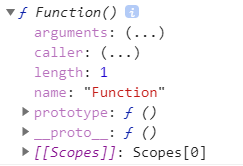
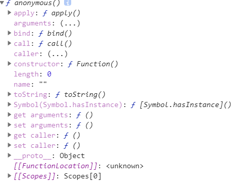
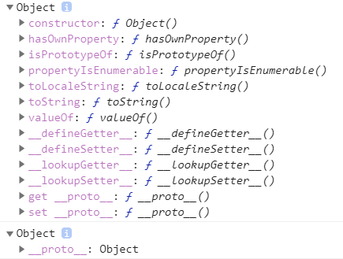

# 对象
> 无序属性的集合, 其属性可以包含基本值, 对象, 或者函数

## 理解对象 
#### 对象属性描述符

https://developer.mozilla.org/zh-CN/docs/Web/JavaScript/Reference/Global_Objects/Object/defineProperty

- 数据描述符  
  - value
  - configurable
  - enumerable
  - writable

- 存取描述符
  - configurable
  - enumerable
  - get
  - set

  ```js
  // 字面量指定
  const obj ={
    get a(){
        return this._a
    },
    set a(val){
        this._a = val*2
    }
  }  
  // Object.defineProperty 指定
  Object.defineProperty(obj,'a',{
    get: function(){
      return this._a
    },
    set :function(val){
      this._a = val*2
    }
  })
  //存取
  obj.a = 1;
  console.log(obj.a) //2
  ```

## 创建对象
### 工厂模式
```js
function createPerson(name, age, job){
  const person = {}
  person.name = name
  person.age = age
  person.job = job
  return person
}
const person1 = createPerson('chen', 27, 'programmer')
const person2 = createPerson('hang', 21, 'student')
console.log(person1, person2)
//{ name: 'chen', age: 27, job: 'programmer' } { name: 'hang', age: 21, job: 'student' }
```

### 构造函数模式
```js
function Person(name, age, job){  
  this.name = name
  this.age = age
  this.job = job  
}
const person1 = new Person('chen', 27, 'programmer')
const person2 = new Person('hang', 21, 'student')
console.log(person1, person2)
//Person { name: 'chen', age: 27, job: 'programmer' } Person { name: 'hang', age: 21, job: 'student' }
```

#### 构造函数 Constructor
  - 函数对象天生自带一个属性 prototype, 它的值是一个对象. 原型对象包含 constructor 属性, 指向自身, 这个属性可读可写; 原型对象包含 \__proto__ 属性, 指向 Object.prototype

  - 构造函数是函数对象, 同时拥有函数和对象的特质. 构造函数和普通函数只存在调用方式的不同, 构造函数调用需要使用 new 关键字; 另外, 构造函数名字首字母大写作为区分

  - 构造函数内部 this.attribute = "xxx", 将成为实例自身的属性, instance.hasOwnProperty('attribute') 为 true; 同时, 实例可以访问构造函数 prototype 对象的属性; 但是, 实例无法访问构造函数自身的属性 (通过对象赋值法赋予的属性), 只能构造器自身调用. 

  *(prototype 是给别人"继承"的, \__proto__是继承自别人的; 应该是通过赋值: instance.\__proto__ = Constructor.prototype; prototype 只看自己即可, \__proto__可以一层一层网上捋, 就是原型链)*

##### new 操作符
```js
function newMock(){
  const obj = {}  //(1)
  const Constructor = [].shift.apply(arguments)
  obj.__proto__ = Constructor.prototype  //(2)
  const result = Constructor.apply(obj, arguments)  //(3)     
  return result instanceof Object ? result : obj  //(4)
}
function Creation(name, age, job){    
  this.name = name
  this.age = age
  this.job = job     
}
const final = newMock(Creation, 'chen', 27, 'programmer')
console.log(final) //Creation { name: 'chen', age: 27, job: 'programmer' }
```
(1) 创建空对象 obj  
(2) 将构造函数的原型对象与空对象的 \__proto__ 属性绑定  
(3) 通过 apply 方法, 使得 obj 成为构造函数的调用者; 并执行构造函数    
(4) 对构造函数的返回值进行判断
- 构造函数内没有以 this 作为前缀的变量, 不会包含在实例对象中; 构造函数自身的属性, 不会包含在实例对象中
- 构造函数体中的 return 语句, 原始值会被忽略, 引用类型会返回 (这样, 使用 new 操作符就没有意义了, 所以千万不要写)

*好多人云亦云的文章, 不知所谓! 越看越糊涂, 怎么也理解不了; 然后找到一篇讲得好的, 感觉一下子就通了, 但是这样的好文章也会存在漏洞和不严谨; 务必自己多思考多实践, 手底下见真章! (把这个写出来, 看到预期的运行结果的时候真的打心底里快乐, 我是真的喜欢, 要加油鸭, 为了自己所爱冲鸭)*

##### 内置构造函数
**Object, Array, Date, Function** 
- typeof 都是 function; constructor 都是 Function (包括 Function 自己); 都是 Object 的实例 
- 数组的 constructor 是 Array, 但它同时是 Array 和 Object 的实例. 所有引用类型都是对象, 所有对象都是 Object 的实例(有例外)
- 通过 new Function() 得到的是一个函数对象, 可以充当构造函数创建对象; 它同时是 Function 和 Object 的实例
  

**(Math, JSON 是以对象形式存在的, 无需 new. 它们的 \__proto__ 是 Object.prototype)**

##### 自定义构造函数
自定义构造函数也就是和 new 操作符一起调用的普通函数, 都是 Function 的实例, 也是 Object 的实例

#### 实例对象
- 实例对象拥有 \__proto__ 属性, 和其构造函数的 prototype 指向同一个对象. instance.\__proto__ 和 Object.getPrototypeOf(instance) 都等于 Constructor.prototype. 

- 实例对象 \__proto__ 属性下包含 constructor 属性, 指向实例对象的构造函数.

#### Object 与 Function 的关系 
> 记住 js 一切都是人为(赋予) 的, 所以绝不会存在鸡蛋问题

*(这一部分本来应该是放在内置构造函数里, 但是实在是关系重大, 就单独拿出来了)

##### Function
```js
console.dir(Function)  //(1)
console.dir(Function.prototype) //(2)
console.dir(Function.__proto__) //(3)
console.dir(Function.__proto__.__proto__)  //(4)
console.dir(Function.__proto__.__proto__.__proto__) //(5) -- null
```
(1) Function 作为内置的函数对象, 既有函数的特质, 又有对象的特质  
- 函数的 **prototype** 属性
- 对象的 **\__proto\__** 属性

   

(2) Function.prototype 结果是一个匿名函数
- Function 是 js 中唯一一个默认 prototype 为函数的 (自定义构造函数的 prototype 就正常了, 是 Object 的实例对象)
- 注意: 该匿名函数没有 prototype 属性 (自定义函数是有的); 同时, 它也不是 Function 的实例 (它只是 Object 的实例, 它拥有 \__proto__ 属性, 可以通过一个事物的特性来推断它的类别)
```js
console.dir(Function.prototype instanceof Function) //false
console.dir(Function.__proto__ instanceof Object) //true
```

 

(3) Function.\__proto__ 结果是一个匿名函数, 同 (2) 一样

(4) Function.\__proto__.\__proto__ 结果**似乎**是 Object 的实例对象 (以后称作 "类 Object 的实例对象")
- 它和通过 new Object() 生成的实例对象有很大区别: 它不仅拥有 \__proto__属性, 而是拥有 constructor 属性

- 它既不是 Object 的实例, 也不是 Function 的实例...就蛮迷的...

```js
console.dir(typeof Function.__proto__.__proto__)  //object
console.dir(Function.__proto__.__proto__ instanceof Object) //false
console.dir(Function.__proto__.__proto__ instanceof Function) //false
```

 

(5) 结果是 null
值得注意的是, 在第 (4) 步的结果中, 可以看到 \__proto__ 这一属性不是直接给出的, 而是用的存取描述符

https://juejin.im/post/5b3798f851882574c105c51c

##### Object
```js
console.dir(Object)  //(1)
console.dir(Object.prototype) //(2)
console.dir(Object.__proto__) //(3)
console.dir(Object.__proto__.__proto__)  //(4)
console.dir(Object.__proto__.__proto__.__proto__) //(5) -- null
```
(1) 和 Function 一样, Object 也同时拥有 prototype 与 \__proto__属性; 但是与 Function 相比, Object 拥有的其他属性更多

(2) Object.prototype 结果是 "类 Object 的实例对象" ( 参见 Function (4) )

(3) Object.\__proto__ 是一个匿名函数

(4) Object.\__proto__.\__proto__ 结果和 (2) 一样

(5) 结果是 null

##### 小总结
上面的结果中, 有两个关键点: **匿名函数**, **写着 Object 然而并不是 Object 实例的对象**
- 匿名函数: 是 Object 的实例, 但不是 Function 的实例
- "类 Object 实例对象": 类型是 object, 但既不是 Object 的实例, 也不是 Function 的实例; 这个对象的 \__proto__ 为 null
- Object.prototype: 一个不是 Object 实例的对象; Function.prototype: 一个不是 Function 实例的函数, 但是是 Object 实例;  Array.prototype: 一个不是 Array 实例的数组, 但是是 Object 实例; 其他: 普通的 Object 实例

**Object, Function, Array 是比较特别的存在**

*(一个不是 Function 实例的函数, 一个不是 Object 实例的对象, 妙啊)*

#### 原型链 (\__proto__指向)  
> 原型链是对象属性访问方式 (作用域链是变量访问方式)

原型链是一种机制，指的是 JavaScript 每个对象都有一个内置的 \__proto__ 属性指向创建它的构造函数的 prototype 属性。
由于 \__proto__ 是任何对象都有的属性, 而 js 里万物皆对象, 所以最终会形成一条 \__proto__ 连起来的链条, 递归访问 \__proto__ 必须最终到头, 并且值是 null  
当 js 引擎查找对象的属性时, 先查找对象本身是否存在该属性, 如果不存在, 会在原型链上查找, 但不会查找自身的 prototype

##### 以自定义构造函数创建的对象为切入点进行分析
```js
function Person(name, age, job){  
  this.name = name
  this.age = age
  this.job = job         
}
const person = new Person('chen', 27, 'programmer')
console.dir(person) 
```
 

(1) person.\__proto__: 也就是 Person.prototype, 典型的原型对象, 是 Object 的实例; 包含 constructor (指向 Person) 和 \__proto__ 两个属性
(2) person.\__proto__.\__proto__: 也就是原型对象构造函数 Object 的 prototype, 是 "类 Object 实例对象", 它是由谁来构建的? 想知道一个对象的构建者可以访问 object.\__proto__.constructor, 然而从 (3) 中可以得知, "类 Object 实例对象" 的 \__proto__ 并不存在, 也就更不可能有 constructor 属性. 这是不是说明这个对象已经是 js 中的顶层对象, 是唯一一个并非由构造函数创建的对象, 这个对象赋值给了 Object.prototype (内置构造函数也就是别人提前定义好给我们用的, 一切属性都是被赋予的)
(3) person.\__proto__.\__proto__.\__proto__: null (通过存取操作符获得)

*(为什么我自己要强调 js 是人为的, 不存在什么鸡蛋的问题, 因为它确实是人造的, 是从顶层一点点流下来的...一层层创建, 赋值, 继承, 这样子形成的, 不搞清祖先, 何谈继承)*

##### 内置构造函数 new Object 创建的对象
```js
const obj = new Object()
console.dir(obj.__proto__) // "类 Object 实例对象"
```
##### Object.create 创建的对象
```js
const obj1 = {name: 'chen'}
const obj2 = Object.create(obj1)
console.dir(obj2.__proto__ == obj1) //true
```
也就是这种创建方式将 obj1 直接赋值给了被创建对象的 \__proto__ 属性


### 原型模式
创造对象最常见的方式就是组合使用构造函数模式与原型模式. 构造函数模式用于定义实例属性, 而原型模式用于定义方法和共享的属性.


## 继承


## JS中区分对象和数组的四种方法
```js
//(1)
{}.constructor    //Object
[].constructor    //Array

//(2)
[] instance of Array   //true
{} instance of Array   //false

//(3)
Array.isArray([])  //true
Array.isArray({})  //false

//(4)
Object.prototype.toString.call([])   //["object Array"]
Object.prototype.toString.call({})   //["object Object"]
```
