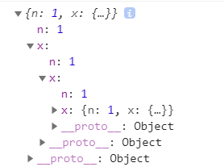

### 满足好奇心
#### querySelector 和 getElementById方法的区别
http://www.imooc.com/article/13027

#### 为什么 script 标签一般放在 body 下面
https://www.jianshu.com/p/86250c123e53
按照HTML5标准中的HTML语法规则，如果在后再出现或任何元素的开始标签，都是 parse error，浏览器会忽略之前的，即视作仍旧在 body 内。所以实际效果和写在之前是没有区别的

把 script 脚本放在 html 结束标签外会怎么样
效果等同于放在 body 中的尾部 ...

自己页面审查元素,虽然你把 script 标签放在 body 之外,但是解析结果是在body的尾部...
把在 head 中不支持的元素放在 head ,结果一样会渲染在 body 的头部 ... 
都是为了防止这种不规范的操作出现错误的渲染结果


#### 获取给定范围的随机数
Math.ceil(Math.random()*(this.wordBase.length-1)) 似乎取不到 0, Math.ceil(0) 的结果是 0 啊, 为什么取不到呢
parseInt(Math.random()*(this.wordBase.length)) 这样就没问题了

#### 为什么在 if else 使用 const 定义的变量无法在外面访问 (V)
```js
const a = 3
if(a > 3){
  const test1 = 'test1'
}else{
  const test2 = 'test2'
}
console.log(test1)
// or
console.log(test2)
//二者都是 'is not defined'
//一般这种都是处理相同的数据在不同情况下的表现, 应该是同一个变量 if...const test = 'xxx'......else...const test = 'xxx'; 可以使用三目运算符
//傻了呀, 那是下一级的块级作用域啊 (20200702)
```

#### 连续赋值
```js
var a = {n:1};  
var b = a; 
a.x = a = {n:2}; //(1)
console.log(a);// --> {n:2} 
console.log(b);// --> {n:1; x: {n: 2}}

var d = {n: 1}
d.x = d
console.log(d)  //(2)

var d = {n: 1}
d.x = {test: 'test'}
d = d.x
console.log(d) //(3) {test: 'test'}
console.log(d == d.x) //false
console.log(d.x) //undefined
```
(1) 由于 . 运算优先高于 = 赋值运算, 所以这一语句等同于 a = a.x = {n:2} (这两条语句执行的结果是一致的)(这个因果关系老实说没有懂, 优先级高就要换顺序吗?)[完全错误, 看起来一样未必真的一样]  
(2) 出现可怕的循环引用 
  
(3) 重新赋值, 之前的连接(指向)断裂; 但是和 var a = {n:1};  var b = a; 这种相比还是不同

**正解**  
1. 先获取等号左侧的a.x，但a.x并不存在，于是JS为（堆内存中的）对象创建一个新成员x，这个成员的初始值为undefined，（这也是为什么直接引用一个未定义的变量会报错，但是直接引用一个对象的不存在的成员时，会返回undefined.）
2. 创建完成后，目标指针已经指向了这个新成员 x，并会先挂起，单等等号右侧的内容有结果了，便完成赋值。
3. 接着执行赋值语句的右侧，发现a={n:2}是个简单的赋值操作，于是a的新值等于了{n:2}。这里特别注意，这个a已经不是开头的那个a，而是一个全新的a,这个新a指针已经不是指向原来的值的那个堆内存，而是分配了一个新的堆内存。但是原来旧的堆内存因为还有b在占用，所以并未被回收。然后，将这个新的对象a的堆内存指针，赋值给了刚才挂起的新成员x,此时，对象成员x便等于了新的对象a。所以，现在 b={n:1,x:{n:2}};a={n:2}; a===b.x

关键点一：隐含的变量声明与提升. a.x 即完成了 x 的声明，其值为 undefined  
关键点二：对象成员等待赋值时，锁定的赋值目标是成员，而非对象. 在本例中, x 变量存在于开始 a b 共同指向的内存中, 后来 a 的连接断了, 但是并不影响 x

**不要在 js 中使用连续赋值**

运算符优先级: https://developer.mozilla.org/zh-CN/docs/Web/JavaScript/Reference/Operators/Operator_Precedence

##### LHS 查询与 RHS 查询 (你不是知道的 js)
LHS 查询: 获取容器. 发生在赋值操作中, 此时不需要知道它目前的值, 只需要将新的值赋予它(放入容器)  
RHS 查询: 获取源值. 发生在输出操作中(如 console.log(xxx))

##### 变量声明与赋值 (以 var a = 2 为例)
这是两个步骤:     
1. 变量声明 (var a): 在作用域内进行查找, 如找到, 则忽略此声明, 否则在当前作用域的集合中声明一个新的变量, 并命名为 a
2. 变量赋值 (a = 2): 发生 LHS 查询, 在作用域内查找, 是否存在变量 a, 如果存在, 赋值, 否则报错 (写在一起当然不会存在找不到的情况)

**对象的属性与一般的变量有区别, 访问未经声明的变量会报错, 但是访问对象 "不存在" 的属性返回 undefined**