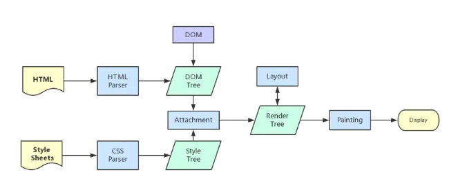

# 前端面试题 - 自己觉得需要的
> 要注意阶段, 不是自己这个阶段的题就不要管了; 要注意层次, 有的要细细研究, 有的能背下来就行
着重自己熟悉的知识, 离自己近的知识, 太远的很难理解和记忆
期末考复习模式开始了, 拿出当年的状态 (我抱佛脚的能力还是很强的)

https://juejin.im/post/5eace2176fb9a04340658974#heading-140

## CSS

### rem和em有区别嘛? 1em等于多少像素

### 一般简单的动画为什么用css3的animation而不是用position动画？
我：position动画会脱离文本流，动画性能消耗大，而css3动画基于帧动画，浏览器可对动画做优化，性能提高不少
（其实华哥也不太确定这样答对不对，只见面试官点了点头）

## JavaScript

### 字符串的一些常用方法

### ES6
#### 箭头函数
#### let，const 和 var 的区别
#### map 和 forEach 的区别

## Vue

## 浏览器

### cookie、SessionStroage、LocalStroage这三者的区别。

### 浏览器缓存

## 网络 (http)

### 原生Ajax和axios的区别，Ajax怎么发送http请求的？

## 安全

## 性能

## 其他 (综合)

### 前端的异常处理

https://blog.csdn.net/LuckyWinty/article/details/103268296

### 从输入URL到页面加载发生了什么？ ==> 优化之路

### 浏览器中输入网址

<!-- ### 查询缓存
浏览器查询是否有当前页面的资源缓存, 如果有, 直接取得资源, 开始解析渲染过程; 否则进入下一步   -->

#### DNS 解析
在网络世界，你肯定记得住网站的名称，但是很难记住网站的 IP 地址，因而也需要一个地址簿，就是 DNS 服务器  
这一步在于获取 URL 对应的 IP 地址

#### 建立 TCP 连接
获取地址后, 客户端想要与服务器间通信并传递消息需要开启 TCP 连接  
首先，判断是不是 https 的，如果是，则HTTPS其实是HTTP + SSL / TLS 两部分组成，也就是在HTTP上又加了一层处理加密信息的模块。服务端和客户端的信息传输都会通过TLS进行加密，所以传输的数据都是加密后的数据。
接着, 进行三次握手, 建立 TCP 连接  
- (1) 客户端：hello，你是server么？
- (2) 服务端：hello，我是server，你是client么
- (3) 客户端：yes，我是client

如果是 https, 则还需要额外的 SSL 握手过程

#### 发送 HTTP 请求 & 服务器处理请求并返回 HTTP 报文
TCP 连接建立后，浏览器就可以利用 HTTP／HTTPS 协议向服务器发送请求了。  
服务器接受到请求，就解析请求头，如果头部有缓存相关信息如 if-none-match 与 if-modified-since，则验证缓存是否有效，若有效则返回状态码为 304，若无效则重新返回资源，状态码为 200.

#### 浏览器下载资源, 解析代码, 渲染页面
浏览器下载 HTML, CSS, JS 资源后, 如果服务器有 gzip 压缩，浏览器先解压, 解压完成后开始渲染页面
这一部分比较重要 (是我能接触到, 能操作的, 能理解的; 并且能够优化, 有用的)

##### gzip 压缩
首先，明确gzip是一种压缩格式，需要浏览器支持才有效（不过一般现在浏览器都支持），
而且gzip压缩效率很好（高达70%左右）
然后gzip一般是由apache、tomcat等web服务器开启
当然服务器除了gzip外，也还会有其它压缩格式（如deflate，没有gzip高效，且不流行）
所以一般只需要在服务器上开启了gzip压缩，然后之后的请求就都是基于gzip压缩格式的，
非常方便

##### http 缓存
前后端的http交互中，使用缓存能很大程度上的提升效率，而且基本上对性能有要求的前端项目都是必用缓存的
缓存可以简单的划分成两种类型：强缓存（200 from cache）与协商缓存（304）
区别简述如下：

强缓存（200 from cache）时，浏览器如果判断本地缓存未过期，就直接使用，无需发起http请求

协商缓存（304）时，浏览器会向服务端发起http请求，然后服务端告诉浏览器文件未改变，让浏览器使用本地缓存

对于协商缓存，使用Ctrl + F5强制刷新可以使得缓存无效
但是对于强缓存，在未过期时，必须更新资源路径才能发起新的请求（更改了路径相当于是另一个资源了，这也是前端工程化中常用到的技巧）

##### 页面渲染
1. 解析HTML，构建DOM树

2. 解析CSS，生成CSS规则树

3. 合并DOM树和CSS规则，生成render树

4. 布局render树（Layout/reflow），负责各元素尺寸、位置的计算

5. 绘制render树（paint），绘制页面像素信息

6. 浏览器会将各层的信息发送给GPU，GPU会将各层合成（composite），显示在屏幕上

##### 资源外链的下载
在解析 html 时，会遇到一些资源连接，此时就需要进行单独处理了
简单起见，这里将遇到的静态资源分为一下几大类（未列举所有）
CSS样式资源
JS脚本资源
img图片类资源

#### 连接结束
四次挥手
- (1) 主动方：我已经关闭了向你那边的主动通道了，只能被动接收了
- (2) 被动方：收到通道关闭的信息
- (3) 被动方：那我也告诉你，我这边向你的主动通道也关闭了
- (4) 主动方：最后收到数据，之后双方无法通信

