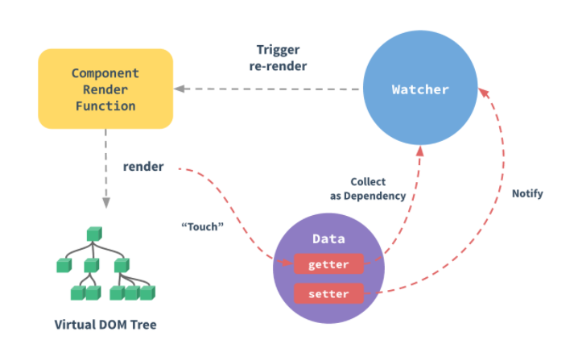

# 前端面试题 - 自己觉得需要的
> 要注意阶段, 不是自己这个阶段的题就不要管了; 要注意层次, 有的要细细研究, 有的能背下来就行
着重自己熟悉的知识, 离自己近的知识, 太远的很难理解和记忆
期末考复习模式开始了, 拿出当年的状态 (我抱佛脚的能力还是很强的)

https://juejin.im/post/5eace2176fb9a04340658974#heading-140

## HTML
### HTML5 新特性
- 标签的语义化  Header,footer,section,nav,aside,article...  
- 增强型表单(input的type: Color,date,email,number,range,tel)
- 音视频
- canvas
- 地理位置  getCurrentPosition(); watchPosition(); clearWatch();
- 扡拽
- 本地存储
- 新事件  Onresize:调整窗口大小; Ondrag：拖动元素; onscroll; Onmousewheel: 鼠标滚轮; onplay; onpause; 
- websocket
- webwoker

### 语义化
所谓，语义化的标签，说明让标签有自己的含义。也是近十年。最典型的栗子就是header，footer等，它可以让你在没有样式的情况下，就大概能想到，他就是个头部或者底部。他存在的意义，就是让前端开发人员，在开发过程中，更容易去阅读代码，以及明白这些代码的意义。
它的好处是：
1.能够更好的展示内容结构
2.便于团队的维护与开发
3.有利于SEO，爬虫可以分析每个关键词的权重。
4.方便其他设备解析 (如屏幕阅读器)

### SEO / 中文称搜索引擎优化
一种利用搜索引擎的搜索规则来提高目前网站在有关搜索引擎内的自然排名的方式。他的实现原来分别为，页面抓取，分析入库，检索排序。

### @import和link引入样式的区别

https://juejin.im/post/6844903581649207309  (需要注意: 权重部分有误, 应该是 "通配符" > 继承)

## CSS
### CSS3 新特性

背景，支持RGBA透明度，一次多背景图

支持媒体查询

支持阴影，渐变，阴影	

支持边框图片，border-image: url(border.png) 30 30 round

支持transform位移系列

支持过渡效果transition	

支持自定义字体

引入flex/grid布局

引入多种选择器


### 盒子模型

W3C 盒模型(标准盒模型)  

通过 box-sizing: content-box 设置; style 中的 width / height 值为 content。  

IE 盒模型(怪异盒模型)  

通过 box-sizing: border-box 设置; style 中的 width / height 值为 content+padding+border 之和。

### BFC

BFC（Block Formatting Context）块级格式化上下文，是 Web 页面中盒模型布局的 CSS 渲染模式，指一个独立的渲染区域或者说是一个隔离的独立容器。
BFC 形成条件：
1、浮动元素，float 除 none 以外的值；
2、定位元素，position（absolute，fixed）；
3、display 为以下其中之一的值 inline-block，table-cell，table-caption；
4、overflow 除了 visible 以外的值（hidden，auto，scroll）；
BFC 特性：
1.内部的 Box 会在垂直方向上一个接一个的放置；
2.垂直方向上的距离由margin 决定；（解决外边距重叠问题）
3.bfc 的区域不会与 float 的元素区域重叠；（防止浮动文字环绕）
4.计算 bfc 的高度时，浮动元素也参与计算；（清除浮动）
5.bfc 就是页面上的一个独立容器，容器里面的子元素不会影响外面元素；


### 浮动

### Flex 布局

#### flex布局均匀分布后换行问题

### 两栏布局
左右两栏，左边固定，右边自适应

### 三栏布局

### 水平垂直居中
https://juejin.im/post/6858826987688722446


### rem和em有区别嘛? 1em等于多少像素

### 一般简单的动画为什么用css3的animation而不是用position动画？
我：position动画会脱离文本流，动画性能消耗大，而css3动画基于帧动画，浏览器可对动画做优化，性能提高不少


### 伪类与伪元素的区别
*这两个都不是一类的东西, 为什么要管区别, 就因为都带了一个伪字吗*

### 前端隐藏元素: (1)display: none; (2)visibility: hidden; (3)opacity: 0 的区别

https://juejin.im/post/5cf860ade51d4550a629b23b

(1)display: none  
- 元素存在 dom 结构中, 可以被获取;
- 元素不会被渲染(不占用页面空间), 属性值切换会引起浏览器重排和重绘
- 不可交互(触发事件)

(2)visibility: hidden  
- 元素存在 dom 结构中, 可以被获取;
- 元素会被渲染(占用页面空间)
- 不可交互

(3)opacity: 0  
- 元素存在 dom 结构中, 可以被获取;
- 元素会被渲染(占用页面空间)
- 可以交互

### 实现1px

### css 动画与 js 动画的区别

### 样式优化
1.避免css层级太深。有兴趣了解一下css tree如何跟html tree融合成dom tree。
2.首屏（特别是缓冲效果图）可适当使用内联元素。这样有利于更快的显示。
3.异步加载CSS。非首次重要引入的css文件，不放在head里边。这样会引起阻塞。
4.减少 回流 的属性。如display:none可以考虑使用visibility
5.适当使用GPU渲染。如tranfrom等。
6.css动画的性能，是远远的大于js动画性能。
7.利用工具压缩，去重。

作者：逐步前行
链接：https://juejin.im/post/6867715946941775885
来源：掘金
著作权归作者所有。商业转载请联系作者获得授权，非商业转载请注明出处。


## JavaScript

### ES6
#### 模块化
与 CommonJS 的区别

#### let，const 和 var 的区别
1）局部作用域
新引入的let，const声明，再不会再产生变量提升。避免了变量提前访问的场景，间接的提高了严谨性。我们可以在程序运行时就知道了报错，而非后期的调试中。
2）禁止重复声明
如果一个标识符已经在代码块内部被定义，那么在此代码块内使用同一个标识符进行 let 声明就会导致抛出错误
3）区分常量与变量
这是let与const的区别。const 声明会阻止对于变量绑定与变量自身值的修改，避免了我们日常开发中，了不小心改到常量的问题。
4）暂时性死区
下述案例，用let跟var定义的结果，就明白什么叫暂时性死区

#### Symbol

#### 箭头函数

#### 拓展运算符

#### 对象解构

#### class和构造函数的区别

#### map 和 forEach 的区别

### 字符串的一些常用方法

### 手写深度遍历节点


#### 判断类型
typeof 对于原始类型来说，除了 null 都可以显示正确的类型。但是对于对象来说，除了函数都会显示 object，所以他的作用，仅仅只能判断原始类型，判断不了对象。
instanceof，用于判断一个变量是否某个对象的实例，内部机制是通过原型链来判断的。他的确能判断是否类型的是否正确。但一点值得注意，instanceof 检测的是原型，原型链上，每一个类型，都会返回true。所以，只能用来判断两个对象是否属于实例关系， 而不能判断一个对象实例具体属于哪种类型。
constructor, 是原型prototype的一个属性，当函数被定义时候，js引擎会为函数添加原型prototype，并且这个prototype中constructor属性指向函数引用， 因此重写prototype会丢失原来的constructor。
但是他也有明显的缺陷：
1：null 和 undefined 无constructor，这种方法判断不了。
2：还有，如果自定义对象，开发者重写prototype之后，原有的constructor会丢失，因此，为了规范开发，在重写对象原型时一般都需要重新给 constructor 赋值，以保证对象实例的类型不被篡改。
toString是几个方案中，相对比较不错的方案。建议使用。toString() 是 Object 的原型方法，调用该方法，默认返回当前对象的 [[Class]] 。这是一个内部属性，其格式为 [object Xxx] ，其中 Xxx 就是对象的类型。

#### 类型转换

#### 高阶函数
#### 柯里化函数
#### 纯函数

## Vue
#### mvvm vs mvc

### 响应式系统 /(单向)数据绑定
“Reactivity, among JavaScript frameworks, is the phenomenon in which changes in the application state are automatically reflected in the DOM.”
通俗的说, 就是一旦更新了 data 中的某个属性数据, 所有界面上直接使用或简洁使用了此属性的节点都会更新

https://vuejs.org/v2/guide/reactivity.html



当一个 Vue 实例被创建时，它将 data 对象中的所有的属性加入到 Vue 的响应式系统中。当这些属性的值发生改变时，视图将会产生“响应”，即匹配更新为新的值。  
值得注意的是只有当实例被创建时就已经存在于 data 中的属性才是响应式的。如果你知道你会在晚些时候需要一个属性，但是一开始它为空或不存在，那么你仅需要设置一些初始值。  

当实例创建后的数据观察阶段 data 选项的内容会添加到了一个对象中, 然后通过 Object.defineProperty(obj, key, value)的方法遍历, 并设置 get set 方法, 作为响应的基础, 这也就是为什么对象后来新增的属性不是响应式的原因, 它没有经过上述阶段  

由于 JavaScript 的限制，Vue 不能检测数组和对象的变化。深入响应式原理中有相关的讨论。  

Vue.set()(vuex用, 因为它不是vue的实例, 所以不能用后者)/this.$set()  
Vue.set( target, key, value )  
向响应式对象中添加一个属性，并确保这个新属性同样是响应式的，且触发视图更新。它必须用于向响应式对象上添加新属性，因为 Vue 无法探测普通的新增属性 (比如 this.myObject.newProperty = 'hi')。注意对象不能是 Vue 实例，或者 Vue 实例的根数据对象。

可以从生命周期的角度来说:
初始化阶段: 通过 defineProperty 方法为 data 中的属性设置 getters/setters
mounted 阶段: render 函数初次渲染, 生成 DOM, 过程中 touch 的属性的 getter 方法触发, 被 Watcher 收集为依赖
数据更新阶段: 数据更新时, 属性的 setter 方法被触发, 通知 Watcher, Watcher 再触发 render函数重新渲染

### 单组件生命周期

### 父子组件的生命周期触发顺序

### 单向数据流


### v-show和v-if的区别
v-show  
- 通过设置元素的 display 属性实现
- 可获取元素
- 如果是组件, 不会触发生命周期
- v-show是在任何条件下（首次条件是否为真）都被编译

v-if  
- 通过动态的向 DOM 树内添加或者删除元素
- v-if是惰性的，如果初始条件为假，则什么也不做；只有在条件第一次变为真时才开始局部编译 (只有为 true 才可获取元素)
- 如果是组件, 会触发生命周期
- v-if切换有一个局部编译/卸载的过程，切换过程中合适地销毁和重建内部的事件监听和子组件

v-if会在切换过程中对条件块的事件监听器和子组件进行销毁和重建，如果初始条件是false，则什么都不做，直到条件第一次为true时才开始渲染模块。
v-show只是基于css进行切换，不管初始条件是什么，都会渲染。
所以，v-if切换的开销更大，而v-show初始化渲染开销更大，在需要频繁切换，或者切换的部分dom很复杂时，使用v-show更合适。渲染后很少切换的则使用v-if更合适。

### Vue 中的 key 有什么作用
https://vuejs.org/v2/api/#key

https://michaelnthiessen.com/understanding-the-key-attribute/

https://deepsource.io/blog/key-attribute-vue-js/

The key special attribute is primarily used as a hint for Vue’s virtual DOM algorithm to identify VNodes when diffing the new list of nodes against the old list. Without keys, Vue uses an algorithm that minimizes element movement and tries to patch/reuse elements of the same type in-place as much as possible. With keys, it will reorder elements based on the order change of keys, and elements with keys that are no longer present will always be removed/destroyed.

Children of the same common parent must have unique keys. Duplicate keys will cause render errors.

当Vue用 v-for 正在更新已渲染过的元素列表时，它默认用“就地复用”策略。如果数据项的顺序被改变，Vue将不是移动DOM元素来匹配数据项的改变，而是简单复用此处每个元素

**不使用 key (vue 不允许) / 使用 index 作为 key 时:**
Vue prefers to reuse as much of the DOM as it can and try to make the manipulations at the data level and not at the DOM level.
VUE 尽可能地减少对 DOM 的操作, 比如移动和替换; 只依据数据模型更改 DOM 展示的内容 (也就是文本节点)
- 元素的样式, 会一直保留
- 临时的 DOM 状态, 比如用户的输入, 如果通过 v-model 传递至 data model, 那么会一直停留在原地
- 元素 / 组件不会销毁, 无法触发自定义指令的钩子 / 组件的生命周期钩子

*为什么使用独有的 key 之后, 用户输入没有消失呢?*

响应式 观察者 diff render function

### computed 和 watch 的区别和运用的场景
computed  
- 支持缓存，只有依赖数据发生改变，才会重新进行计算
- 不支持异步，当computed内有异步操作时无效
- 如果一个属性依赖其他一个或多个属性, 一般用computed
*简写为 get 方法, 改变计算属性会报错; 如果需要更改, 要使用对象, 同时写上 get 和 set 方法*

watch  
- 不支持缓存，数据变，直接会触发相应的操作  
- 支持异步
- 监听数据必须是data中声明过或者父组件传递过来的props中的数据
- 当监听的属性发生变化时，执行回调函数, 对其他一个或多个属性进行操作
*简写为 handler, 如果需要设置其他属性, 使用对象*
```js
watch: {
  firstName: {
    handler(newName, oldName) {
      this.fullName = newName + ' ' + this.lastName;
    },    
    immediate: true, //观察开始时立即执行 handler
    deep: true // deep的意思就是深入观察，监听器会一层层的往下遍历，给对象的所有属性都加上这个监听器，但是这样性能开销就会非常大了，任何修改obj里面任何一个属性都会触发这个监听器里的 handler (针对对象的特定属性, 可以使用字符串的形式监听, 如 obj.a)
  }
}
```

https://vuejs.org/v2/guide/computed.html
官方文档, 经典书籍, 赛高

### vue 异步更新的策略以及 nextTick 的用途和原理
https://juejin.im/post/6844903609822363661#comment

vue实现响应式并不是数据发生变化后 dom 立即变化，而是异步执行 DOM 更新。只要观察到数据变化，Vue 将开启一个队列，并缓冲在同一事件循环中发生的所有数据改变。  
如果同一个 watcher 被多次触发，只会被推入到队列中一次。
```js
export default {
  data () {
    return {
      msg: 0
    }
  },
  mounted () {
    this.msg = 1
    this.msg = 2
    this.msg = 3
  },
  watch: {
    msg () {
      console.log(this.msg)
    }
  }
}
//这段脚本执行我们猜测会依次打印：1、2、3。但是实际效果中，只会输出一次：3
```
nextTick: 在修改数据之后立即使用这个方法，可以获取更新后的 DOM。


### 双向数据绑定的实现原理

### 为何组件中 data 必须是函数
因为对象为引用类型，当复用组件时，由于所有组件的 data 都指向同一个对象，当在一个组件中修改 data 时，其他组件中的 data 会同时被修改；而使用返回对象的函数，由于每次返回的都是一个新对象（Object的实例），引用地址不同，则不会出现这个问题。
new Vue() 选项对象中的 data 可以是对象, 因为其产生的实例是不会被复用的 (根实例只能有一个)

### 为什么 Vue 中只能有一个根实例 / 为什么 template 中只能有一个根元素
因为虚拟 dom 是树结构, 树结构有且只有一个根??


### 何时需要使用 keep-alive?
缓存组件，不需要重复渲染
如多个静态tab页面切换，可以优化性能
常用的2个属性 include exclude
两个生命周期 activated deactivated

### vue 常见的性能优化方式
- 合理使用v-show和v-if
- 合理使用computed 有缓存
- v-for加key,以及避免和v-if同时使用
- 自定义事件，DOM 事件即时销毁 （会导致内存泄露）
- 路由按需加载/懒加载 `component: () => import('@/components/HelloWorld')`
- 合理使用异步组件
- 合理使用keep-alive
- data层级不要太深，扁平化（深度监听时的一次性监听完成）
- 使用vue-loader 在开发环境做模板编译（预编译）
- webpack 层级的优化
- 前端通用的性能优化，如 图片懒加载              

### Vue 组件间通讯有哪几种方式
https://weichen93333.github.io/my_notes/#/Vue/communication


## 浏览器

### 浏览器存储 -- cookie、SessionStroage、LocalStroage, IndexedDB
https://weichen93333.github.io/my_notes/#/related/storage

### 浏览器缓存
1.Service Worker 是运行在浏览器背后的独立线程。
必须HTTPS。
三个步奏：注册（下载：sw.js），监听（等其他worker失效），查看缓存
1）sw线程能够用来和服务器沟通数据（service worker的上下文内置了fetch和Push API）
2）能够用来进行大量复杂的运算而不影响UI响应。
3）它能拦截所有的请求
2.Memory Cache
将资源缓存在了内存中。事实上，所有的网络请求都会被浏览器缓存到内存中，当然，内存容量有限，缓存不能无限存放在内存中，因此，注定是个短期缓存。
内存缓存的控制权在浏览器，前后端都不能干涉。
3.Disk Cache
存储在硬盘中的缓存
强缓存和协商缓存， HTTP Header 来实现的。
Cache-Control > Expires(http1.0产物, 受本地时间影响) > ETag(http1.1出现) > Last-Modified（Last-Modified 打开文件的时候会变，以秒计算的）
4.Push Cache
服务器推送，http2

### 浏览器渲染

### 同源策略

同源策略是一个重要的安全策略，它用于限制一个origin的文档或者它加载的脚本如何能与另一个源的资源进行交互。  
同源策略是浏览器方面的, 请求可以发送出去, 服务器也可以接收到并返回数据, 但是浏览器会把它拦在外面, 于是请求失败.  
如果两个 URL 的 protocol, host, port 都相同的话，则这两个 URL 是同源。


#### 当触发同源策略/发生跨域时, 怎么办?
- JSONP: 原理是 src 本来就是用来请求外部资源的, 自然不受同源策略影响
- CORS: 跨域资源共享(CORS) 是一种机制，它使用额外的 HTTP 头来告诉浏览器让运行在一个 origin (domain) 上的Web应用被准许访问来自不同源服务器上的指定的资源。
- 反向代理: 原理是服务器之间的通讯不受同源策略影响 (代理是一个服务器: 反向代理在客户端架设, 正向代理在服务端架设)

### 垃圾回收


## 网络 (http)

### 原生Ajax和axios的区别，Ajax怎么发送http请求的？

## 安全
**xss 攻击 || crsf 攻击**

https://juejin.im/post/6844903502968258574#comment

https://juejin.im/post/6844903685122703367

https://www.imooc.com/article/296767

https://www.imooc.com/article/76207

## 性能
<!-- 先整自己用得上的, 能懂的 -->

### 感知性能
对于用户来说，用户的感知性能才是最重要的，你的页面可以做的不快，但是你可以让你的用户觉得你很快(慢的很稳定, 就像井然有序的队伍)。
- loading 加载
- 骨架屏

### 客观性能
#### 项目开发- 本地开发时 (主要在于减少客户端负担)
#####  减少重排与重绘  
https://segmentfault.com/a/1190000016990089

##### 防抖与节流

https://weichen93333.github.io/my_notes/#/javascript/practices


#### 项目构建 - 打包生成文件时 (主要在于减少体积)
##### gzip 压缩
下方代码可忽略: 不知道是 vue 自动压缩了, 还是 Nginx
```js
//npm i -D compression-webpack-plugin
configureWebpack: config => {
  const CompressionPlugin = require('compression-webpack-plugin')
  config.plugins.push(new CompressionPlugin())
}
```

#### 项目上线 - 页面呈现时 (主要在于网络资源优化)
##### Service Worker
##### http 缓存
##### 预加载, 按需加载


## 其他 (综合)

### 前端的异常处理

https://blog.csdn.net/LuckyWinty/article/details/103268296

### 从输入URL到页面加载发生了什么？ ==> 优化之路

*对于非自己领域的内容, 只需要知道每一步做了什么, 为什么要做, 而不需要去研究具体是怎样做的. 比如 tcp 连接, 三次握手只要知道发生了什么, 而发这个包那个包的不用了解 (描述的语言不用那么专业细致, 但也不能太口语化)*

#### 查询缓存
浏览器查询是否有当前页面的资源缓存, 如果有, 直接取得资源, 开始解析渲染过程; 否则进入下一步  
(http 缓存是客户端缓存，浏览器作为客户端接受到服务端响应后，对于响应首部字段进行解析，分析出相应的缓存规则，将资源按规则进行缓存，再次请求时如果命中缓存则直接读取本地缓存不再发出请求。)

http 缓存可以简单的划分成两种类型：强缓存（200 from cache）与协商缓存（304）
- 强缓存（200 from cache）时，浏览器如果判断本地缓存未过期，就直接使用，无需发起http请求
- 协商缓存（304）时，浏览器会向服务端发起http请求，然后服务端告诉浏览器文件未改变，让浏览器使用本地缓存

对于协商缓存，使用Ctrl + F5强制刷新可以使得缓存无效
但是对于强缓存，在未过期时，必须更新资源路径才能发起新的请求（更改了路径相当于是另一个资源了，这也是前端工程化中常用到的技巧）

#### DNS 解析
在网络世界，你肯定记得住网站的名称，但是很难记住网站的 IP 地址，因而也需要一个地址簿，就是 DNS 服务器  
这一步在于获取 URL 对应的 IP 地址  
如果引入了 CDN, 那么情况更加复杂一些...  
如何给女朋友解释什么是CDN？https://juejin.im/post/5d478c48e51d453c135c5a5c#heading-1

#### 建立 TCP 连接
获取地址后, 客户端想要与服务器间通信并传递消息需要开启 TCP 连接  
首先，判断是不是 https 的，如果是，则HTTPS其实是HTTP + SSL / TLS 两部分组成，也就是在HTTP上又加了一层处理加密信息的模块。服务端和客户端的信息传输都会通过TLS进行加密，所以传输的数据都是加密后的数据。
接着, 进行三次握手, 建立 TCP 连接  
- (1) 客户端：hello，你是server么？(客户端发出连接请求)
- (2) 服务端：hello，我是server，你是client么 (服务端收到请求, 同意连接)
- (3) 客户端：yes，我是client (客户端确认)

https://juejin.im/post/6844903958624878606#comment
https://juejin.im/post/6844903834708344840

如果是 https, 则还需要额外的 SSL 握手过程

#### 发送 HTTP 请求 & 服务器处理请求并返回 HTTP 报文
TCP 连接建立后，浏览器就可以利用 HTTP／HTTPS 协议向服务器发送请求了。  
服务器接受到请求，就解析请求头，如果头部有缓存相关信息如 if-none-match 与 if-modified-since，则验证缓存是否有效，若有效则返回状态码为 304，若无效则重新返回资源，状态码为 200.

#### 浏览器下载资源, 解析代码, 渲染页面
浏览器下载 HTML, CSS, JS 资源后, 如果服务器有 gzip 压缩，浏览器先解压, 解压完成后开始渲染页面
这一部分比较重要 (是我能接触到, 能操作的, 能理解的; 并且能够优化, 有用的)

##### gzip 压缩
gzip 是一种压缩格式, 可以在进行 webpack 配置, 从而在打包时生成 .gz 文件, 这样服务器就不需要进行压缩, 给服务器省一点力气.

##### 页面渲染


- HTML parser：HTML解析器，其本质是将HTML文本解释成DOM tree。
- CSS parser：CSS解析器，其本质是将 DOM 中各元素对象加入样式信息
- JavaScript 引擎：专门处理JavaScript脚本的虚拟机，其本质是解析JS代码并且把逻辑（HTML和CSS的操作）应用到布局中，从而按程序要的要求呈现相应的结果
- DOM tree: 文档对象模型树，也就是浏览器通过HTMLparser解析HTML页面生成的HTML树状结构以及相应的接口。
- render tree：渲染树，也就是浏览器引擎通过DOM Tree和CSS Rule Tree构建出来的一个树状结构，和dom tree不一样的是，它只有要最终呈现出来的内容，像或者带有display:none的节点是不存在render tree中的。
- layout：也叫reflow 重排，渲染中的一种行为。当rendertree中任一节点的几何尺寸发生改变了，render tree都会重新布局。
- repaint：重绘，渲染中的一种行为。render tree中任一元素样式属性（几何尺寸没改变）发生改变了，render tree都会重新画，比如字体颜色、背景等变化。

##### 资源外链的下载
在解析 html 时，会遇到一些资源连接，此时就需要进行单独处理了
简单起见，这里将遇到的静态资源分为一下几大类（未列举所有）
CSS样式资源
JS脚本资源
img图片类资源


#### 连接结束
四次挥手
- (1) 主动方：我已经关闭了向你那边的主动通道了，只能被动接收了
- (2) 被动方：收到通道关闭的信息
- (3) 被动方：那我也告诉你，我这边向你的主动通道也关闭了
- (4) 主动方：最后收到数据，之后双方无法通信


