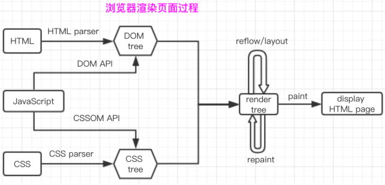

# 前端面试题 - 自己觉得需要的
> ​        面对题目, 要注重结果, 不管结果是否完全理解, 是否完备正确; 不要不太理解就留一个模糊的感觉在那里; 敢于 "选择", 敢于 "说错".
> 
>​        并不一定要动手实践, 动口也行, 书读百遍, 其义自见, 至少你自己信了, 觉得熟得很, 是这么回事.

**当你觉得自己不行了的时候，站上斑马线，你又是个行人了**

## 环境

### 移动端开发和 pc 端开发的区别

- pc 端需要考虑浏览器兼容性, 几个主流浏览器的内核不一样; 移动端基本都是 webkit 内核, 不需要考虑浏览器兼容性, 而需要考虑操作系统兼容性和屏幕尺寸适配
- 在部分事件的处理上，移动端自然是偏向于触屏的，所以触屏事件的一些规律要多摸索一下

#### 移动端响应式

https://weichen93333.github.io/my_notes/#/css/mobile

## HTML

### HTML5 新特性
- 标签的语义化  header,footer,section,nav,aside,article...  
- 增强型表单(input的type: Color,date,email,number,range,tel)
- 音视频
- 本地存储
- canvas
- 地理位置  getCurrentPosition(); watchPosition(); clearWatch();
- 扡拽
- 新事件  Onresize:调整窗口大小; Ondrag：拖动元素; onscroll; Onmousewheel: 鼠标滚轮; onplay; onpause; 
- websocket
- webwoker

### 语义化
所谓，语义化的标签，说明让标签有自己的含义。也是近十年。最典型的栗子就是header，footer等，它可以让你在没有样式的情况下，就大概能想到，他就是个头部或者底部。他存在的意义，就是让前端开发人员，在开发过程中，更容易去阅读代码，以及明白这些代码的意义。
它的好处是：
1.能够更好地展示内容结构
2.便于团队的维护与开发
3.有利于SEO，爬虫可以分析每个关键词的权重。
4.方便其他设备解析 (如屏幕阅读器)

### SEO / 搜索引擎优化
一种利用搜索引擎的搜索规则来提高目前网站在有关搜索引擎内的自然排名的方式。他的实现原来分别为，页面抓取，分析入库，检索排序。

### @import和link引入样式的区别

https://juejin.im/post/6844903581649207309  (需要注意: 权重部分有误, 应该是 "通配符" > 继承)
- @import是 CSS 提供的语法规则，只有导入样式表的作用 (在 css 文件中或 style 标签中使用)；link是HTML提供的标签，不仅可以加载 CSS 文件，还可以定义 RSS、rel 连接属性等。
- 加载页面时，link标签引入的 CSS 被同时加载；@import引入的 CSS 将在页面加载完毕后被加载。
```html
<!DOCTYPE html>
 <html lang="en"> 
<head> 
<link rel="stylesheet" rev="stylesheet" href="myCss.css" type="text/css" > 
<style type="text/css" >                
@import url("./myCss.css");            
</style>
 </head> 
</html>
```

## CSS
### CSS3 新特性
- 过渡 transition
- 动画 animation
- 形状转换 transform
- 新增选择器 (绝大部分为伪类选择器), 如 :first-of-type, :nth-child(n)
- 阴影 box-shadow
- 边框图片 border-image
- 支持 RGBA, 如不兼容则需要分开写 RGB, opacity
- 引入flex/grid布局


### 盒子模型

**W3C 盒模型(标准盒模型)**  
通过 box-sizing: content-box 设置; style 中书写的 width / height 值为 content 盒子宽高。  

**IE 盒模型(怪异盒模型)**  
通过 box-sizing: border-box 设置; style 中书写的 width / height 值为 content+padding+border 宽高之和。


### BFC

BFC（Block Formatting Context）块级格式化上下文，是 Web 页面中盒模型布局的 CSS 渲染模式，指一个独立的渲染区域或者说是一个隔离的独立容器。

**下列方式会创建块格式化上下文 / 触发 BFC：**
- 根元素 html
- 浮动元素，float 除 none 以外的值
- 定位元素，position（absolute，fixed）
- display 为以下其中之一的值 inline-block，table-cell，table-caption
- display 为 flow-root, 可以创建无副作用的 BFC
- overflow 除了 visible 以外的值（hidden，auto，scroll）
- Flex items (flex 容器的直接子元素)

**BFC 特性：**
1.内部的 Box 会在垂直方向上一个接一个的放置；
2.垂直方向上的距离由margin 决定；（解决外边距重叠问题）
3.bfc 的区域不会与 float 的元素区域重叠；（防止浮动文字环绕）
4.计算 bfc 的高度时，浮动元素也参与计算；（清除浮动）
5.bfc 就是页面上的一个独立容器，容器里面的子元素不会影响外面元素；


### 浮动

float 属性指定一个元素应沿其容器的左侧或右侧放置，允许文本和内联元素环绕它。该元素从网页的正常流动(文档流)中移除，尽管仍然保持部分的流动性（与绝对定位相反）。

**表现 (父子元素 father, son):** 

- 子元素将无法继承父元素的宽度(块元素不会占满整行), 但是可以手动设置 width: percentage

- son 设置 float 时, 部分脱离文档流, 会自左上挨着父元素的 content-box; 同时, 父元素高度塌陷, 部分 padding-bottom, border-bottom 被 son 遮挡

**表现 (两个兄弟元素 one, two):** 

- 如果均设置 float: left, 那么自父元素左侧水平方向并排
- 如果仅 one 设置 float, 那么若 two 为 block, one 脱离上浮, two 位置从二排上升至一排, 并被 none 遮挡; 而若 two 为 inline, 那么会自父元素左侧水平方向并排

**导致问题与解决方案:**
- 父元素高度塌陷
- 浮动元素脱离文档流, 导致后面的块级元素上移, 破坏布局
  

**清除浮动(产生的副作用):**
- 在浮动元素后面增加一个兄弟元素, 并在兄弟元素中写上 clear: both (完全清除, 也就是以上两种问题都没有了)
  - 添加冗余元素不是最佳实践, 可以使用伪元素来实现
  father:after{
    content: '';
    display: block;
    clear: both;
  }
  
- 将父级设置为 BFC, 因为 BFC 计算高度的时候同样也会计算浮动元素 (也就是浮动元素依然可以撑开父元素) (部分清除, 只解决高度塌陷问题)

- 在浮动元素后增加 <br clear="all" />

  

### Flex 布局
http://www.ruanyifeng.com/blog/2015/07/flex-grammar.html

- 设为 Flex 布局以后，子元素的float、clear和vertical-align属性将失效。
- flex-basis 属性优先于 width 属性; flex-basis 百分比相对容器的 content-box

#### flex布局均匀分布后换行问题

### 两栏布局 (左边固定，右边自适应)

- flex - 设置 right {flex: 1}
- float - 左右 {float: left}; 右{width: calc(100%-左width)}


### 三栏布局

### 水平垂直居中
https://juejin.im/post/6858826987688722446

#### 水平居中

- 居中对齐margin:0 auto; (右对齐margin-left:auto; 左对齐margin-right:auto)

- 将元素转换为 inline/inline-block，然后其父元素加上 text-align: center;
*text-align CSS属性定义行内内容（例如文字）如何相对它的块父元素对齐。text-align 并不控制块元素自己的对齐，只控制它的行内内容的对齐。*

#### 水平垂直居中

--1
子元素相对于父元素绝对定位，并且margin值减去自己宽高的一半（需知道子元素宽高）
子元素{top: 50%; left: 50%; margin-left: -half self-width; margin-top: -half self-height}
*定位相对于父元素，移动50%是移动父元素width的一半

--2
子元素相对于父元素绝对定位，并且margin值为auto（不需知道子元素宽高）
```css
.divfather{
      background-color: green;
      width: 80px;
      height: 30px;
      margin-bottom: 5px;
      position: relative;
    }
    .divson{
      background-color: red;
      width: 40px;
      height: 10px;
      margin: auto;
      position: absolute;
      top: 0;
      left: 0;
      bottom: 0;
      right: 0;
    }
```

Note: left属性定义了定位元素的左外边距边界与其包含块左边界之间的偏移
必须将left right 同时设置为0，此时auto因设为自动两边而同等填充，直到接触包含块边界，从而满足left right为0，这样就实现了元素居中。
*同时设置margin和left等时，先是margin，然后移动。margin是元素自身属性，left等移动属性居后

--3
diplay：table-cell
该方式是将元素转换成表格样式，再利用表格的样式来进行居中
父元素{display: table-cell; vertical-align: middle}
子元素{margin: auto}

--4 与--1 类似
绝对定位和transfrom
元素{position: absolute; top: 50%; left: 50%; transform: translate(-50%, -50%)}
*translate相对于自己，移动50%是移动自己宽高的一半

--5
css3中的flex属性
父元素{display: flex; justify-content: center; align-items: center}


### 超出省略号

```html
<!-- 单行 -->
{
  width:200px; 
  border:1px solid #000000;
  overflow:hidden;
  white-space:nowrap; 
  text-overflow:ellipsis;
}
```

```html
<!-- 多行 (以两行为例; 其他行数改变 height 和 -webkit-line-clamp 即可) -->
{
  width:400px;  
  border:1px solid #ccc;
  line-height:30px;
  height:60px;
  overflow: hidden;  
  text-overflow: ellipsis;  
  display: -webkit-box;
  -webkit-line-clamp: 2;
  -webkit-box-orient: vertical;
  
}
```


### 一般简单的动画为什么用css3的animation而不是用position动画？
我：position动画会脱离文本流，动画性能消耗大，而css3动画基于帧动画，浏览器可对动画做优化，性能提高不少


### 前端隐藏元素: (1)display: none; (2)visibility: hidden; (3)opacity: 0 的区别

https://juejin.im/post/5cf860ade51d4550a629b23b

(1)display: none  
- 元素存在 dom 结构中, 可以被获取;
- 元素不会被渲染(不占用页面空间), 属性值切换会引起浏览器重排和重绘
- 不可交互(触发事件)

(2)visibility: hidden  
- 元素存在 dom 结构中, 可以被获取;
- 元素会被渲染(占用页面空间)
- 不可交互

(3)opacity: 0  
- 元素存在 dom 结构中, 可以被获取;
- 元素会被渲染(占用页面空间)
- 可以交互

### 实践

#### 画一个三角形、扇形，将一个圆分为四部分，对角部分是相同颜色，相邻部分为不同颜色

#### 实现1px


### 样式优化
1.避免css层级太深。有兴趣了解一下css tree如何跟html tree融合成dom tree。
2.首屏（特别是缓冲效果图）可适当使用内联元素。这样有利于更快的显示。
3.异步加载CSS。非首次重要引入的css文件，不放在head里边。这样会引起阻塞。
4.减少 回流 的属性。如display:none可以考虑使用visibility
5.适当使用GPU渲染。如tranfrom等。
6.css动画的性能，是远远的大于js动画性能。
7.利用工具压缩，去重。


## JavaScript

### DOM 事件流的三个阶段

- 一个 DOM 事件发生时, 会自根元素发出事件流, 一直到达 目标元素的直接父元素, 是事件捕获阶段, 注册在该阶段的事件处理函数会执行 (addEventListener 的第三个参数为 true); 接着到达事件目标位置, 也就是目标阶段; 然后原路返回, 是事件冒泡阶段, 注册在该阶段的事件处理函数会执行.
- 当一个元素上, 捕获和冒泡阶段都注册了事件时, 除了目标元素(事件触发元素), 都会在相应阶段执行函数; 而目标元素, 则是按照注册的顺序, 捕获写在前面, 就先执行捕获, 否则相反
- event.target 是事件触发元素, event.currentTarget 是事件注册元素, 两者可能不一致

### 事件委托

https://www.cnblogs.com/soyxiaobi/p/9498357.html

- “事件代理”即是把原本需要绑定在子元素上的响应事件（click、keydown......）委托给父元素，让父元素担当事件监听的职务。
- 事件代理的原理是事件的捕获/冒泡
- 优点:
  1. 提高性能:每一个函数都会占用内存空间，只需添加一个事件处理程序代理所有事件,所占用的内存空间更少。
  2. 动态监听:使用事件委托可以自动绑定动态添加的元素,即新增的节点不需要主动添加也可以一样具有和其他元素一样的事件。
     

### ES6

#### 模块化

##### 基本

export命令用于规定模块的对外接口，import命令用于输入其他模块提供的功能。

```js
** 定义模块 math.js **/
var basicNum = 0;
var add = function (a, b) {
    return a + b;
};
export { basicNum, add };

/** 引用模块 **/
import { basicNum, add } from './math';
function test(ele) {
    ele.textContent = add(99 + basicNum);
}

//也可以用 export default
// export-default.js
export default function () {
  console.log('foo');
}

// import-default.js
import customName from './export-default';
customName(); // 'foo'
```


##### 与 CommonJS 的区别

CommonJS 基本语法：

- 暴露模块：`module.exports = value`或`exports.xxx = value`
- 引入模块：`require(xxx)`,如果是第三方模块，xxx为模块名；如果是自定义模块，xxx为模块文件路径

加载某个模块，其实是加载该模块的module.exports属性。 require命令用于加载模块文件。require命令的基本功能是，读入并执行一个JavaScript文件，然后返回该模块的exports对象。如果没有发现指定模块，会报错。 

**CommonJS 模块输出的是一个值的拷贝，ES6 模块输出的是值的引用。**

**CommonJS 模块是运行时加载，ES6 模块是编译时输出接口。**

- 什么是运行时加载，什么是编译输出？
- 在后端开发当中，只需要做到一次加载，因此在启动服务器中进行加载即可，对于CommonJS的设计当中符合后端的这种开发理念，然后这种效果带来了很大的便利性，在前端开发也是需要模块化加载方式，可是，前端的加载方式跟后端不一致，如果采用CommonJS相同的加载方式，前端性能会大打折扣，比如网页假死，以及难以改变引入模块的变量，因此，在编译阶段，先将模块按需进行处理，生成接口，在引入模块之后进行使用时，可以很方便的调用接口


#### let，const 和 var 的区别
1）局部作用域
新引入的let，const声明，不会再产生变量提升。避免了变量提前访问的场景，间接的提高了严谨性。我们可以在程序运行时就知道了报错，而非后期的调试中。
2）禁止重复声明
如果一个标识符已经在代码块内部被定义，那么在此代码块内使用同一个标识符进行 let 声明就会导致抛出错误
3）区分常量与变量
这是let与const的区别。const 声明会阻止对于变量绑定与变量自身值的修改，避免了我们日常开发中，了不小心改到常量的问题。
4）暂时性死区 (temporal dead zone)
JavaScript引擎在扫描代码发现变量声明时，要么将它们提升至作用域顶部（遇到var声明），要么将声明放到TDZ中（遇到let和const声明），访问TDZ中的变量会触发运行时错误。只有执行过变量声明语句后，变量才会从TDZ中移除，然后方可正常访问。  
The variables are created when their containing Lexical Environment is instantiated but may not be accessed inany way until the variable’s LexicalBinding is evaluated.


```js
var tmp = 123;
if(true){
tmp='abc';//Uncaught ReferenceError: Cannot access 'tmp' before initialization
let tmp;
}
```


#### Symbol

#### 箭头函数

#### 拓展运算符

#### 对象解构

#### class和构造函数的区别

1.class 声明会提升，但不会初始化赋值。Foo 进入暂时性死区，类似于 let、const 声明变量。 2.class 声明内部会启用严格模式。 3.class 的所有方法（包括静态方法和实例方法）都是不可枚举的。 4.class 的所有方法（包括静态方法和实例方法）都没有原型对象 prototype，所以也没有[[construct]]，不能使用 new 来调用。 5.必须使用 new 调用 class。 6.class 内部无法重写类名。 7.ES5 和 ES6 子类 this 生成顺序不同。ES5 的继承先生成了子类实例，再调用父类的构造函数修饰子类实例，ES6 的继承先生成父类实例，再调用子类的构造函数修饰父类实例。这个差别使得 ES6 可以继承内置对象。


#### map 和 forEach 的区别
forEach()方法不会返回执行结果，而是undefined。也就是说，forEach()会修改原来的数组。而map()方法会得到一个新的数组并返回。

### 字符串的一些常用方法

### 手写深度遍历节点


#### 判断类型
typeof 对于原始类型来说，除了 null 都可以显示正确的类型。但是对于对象来说，除了函数都会显示 object，所以他的作用，仅仅只能判断原始类型，判断不了对象。
instanceof，用于判断一个变量是否某个对象的实例，内部机制是通过原型链来判断的。他的确能判断是否类型的是否正确。但一点值得注意，instanceof 检测的是原型，原型链上，每一个类型，都会返回true。所以，只能用来判断两个对象是否属于实例关系， 而不能判断一个对象实例具体属于哪种类型。
constructor, 是原型prototype的一个属性，当函数被定义时候，js引擎会为函数添加原型prototype，并且这个prototype中constructor属性指向函数引用， 因此重写prototype会丢失原来的constructor。
但是他也有明显的缺陷：
1：null 和 undefined 无constructor，这种方法判断不了。
2：还有，如果自定义对象，开发者重写prototype之后，原有的constructor会丢失，因此，为了规范开发，在重写对象原型时一般都需要重新给 constructor 赋值，以保证对象实例的类型不被篡改。
toString是几个方案中，相对比较不错的方案。建议使用。toString() 是 Object 的原型方法，调用该方法，默认返回当前对象的 [[Class]] 。这是一个内部属性，其格式为 [object Xxx] ，其中 Xxx 就是对象的类型。

#### 类型转换

#### 高阶函数
#### 柯里化函数
#### 纯函数

#### js 性能优化

- **垃圾收集**

  当数据不再有用时，需要通过将值设为null来解除引用，该做法适用于大多数全局变量和全局对象属性

- 事件委托

- 保存多次使用的全局变量

## Vue
### mvvm

MVVM模式是通过以下三个核心组件组成，每个都有它自己独特的角色：

- Model - 应用的数据及业务逻辑，为开发者编写的业务代码

- View - 应用的展示效果，各类UI组件，由 template 和 css 组成的代码

- ViewModel - 扮演“View”和“Model”之间的桥梁，帮忙完成数据绑定和 DOM 事件监听, 负责将数据与视图关联起来, Vue 就是一个 ViewModel


### 响应式系统 /(单向)数据绑定
“Reactivity, among JavaScript frameworks, is the phenomenon in which changes in the application state are automatically reflected in the DOM.”
通俗的说, 就是一旦更新了 data 中的某个属性数据, 所有界面上直接使用或简洁使用了此属性的节点都会更新

https://vuejs.org/v2/guide/reactivity.html


当一个 Vue 实例被创建时，它将 data 对象中的所有的属性加入到 Vue 的响应式系统中。当这些属性的值发生改变时，视图将会产生“响应”，即匹配更新为新的值。  
值得注意的是只有当实例被创建时就已经存在于 data 中的属性才是响应式的。如果你知道你会在晚些时候需要一个属性，但是一开始它为空或不存在，那么你仅需要设置一些初始值。  

当实例创建后的数据观察阶段 data 选项的内容会添加到了一个对象中, 然后通过 Object.defineProperty(obj, key, value)的方法遍历, 并设置 get set 方法, 作为响应的基础, 这也就是为什么对象后来新增的属性不是响应式的原因, 它没有经过上述阶段  

由于 JavaScript 的限制，Vue 不能检测数组和对象的变化。深入响应式原理中有相关的讨论。  

Vue.set()(vuex用, 因为它不是vue的实例, 所以不能用后者)/this.$set()  
Vue.set( target, key, value )  
向响应式对象中添加一个属性，并确保这个新属性同样是响应式的，且触发视图更新。它必须用于向响应式对象上添加新属性，因为 Vue 无法探测普通的新增属性 (比如 this.myObject.newProperty = 'hi')。注意对象不能是 Vue 实例，或者 Vue 实例的根数据对象。

可以从生命周期的角度来说:
初始化阶段: 通过 defineProperty 方法为 data 中的属性设置 getters/setters
mounted 阶段: render 函数初次渲染, 生成 DOM, 过程中 touch 的属性的 getter 方法触发, 被 Watcher 收集为依赖
数据更新阶段: 数据更新时, 属性的 setter 方法被触发, 通知 Watcher, Watcher 再触发 render函数重新渲染


### 双向数据绑定的实现原理

双向绑定技术，不是 Vue 独有的特性，而是一个公共的解决方案，它目前已经被广泛的框架运用。

[原生 JS] 通过 JavaScript 控制 DOM 的展示，就是数据（Data）到模板（DOM）的绑定，这就是数据单向绑定。而双向绑定就是在这个基础上，又扩展了反向的绑定效果，就是模板到数据的绑定。

```js
<p></p>
const data = { value: 'hello' }
document.querySelector('p').innerText = data.value;


<input onkeyup="change(event)" />
<p></p>

<input onkeyup="change(event)" />
const data = { value: '' }
const change = e => {
    // 更新输入值
    data.value = e.target.value;
    // 且，同步值的展示
    document.querySelector('p').innerText = data.value
}
```


vue 中有三种数据绑定形式

- 插值形式 -- {{ data }}
- v-bind -- :class="class"
- v-model

vue 通过数据劫持实现了数据的响应式, 也就是单向绑定, 当数据发生变化时, 视图会自动更新; 同时, vue 通过监听 DOM 事件, 根据用户操作调用事件函数更改数据, 这样就形成了双向数据绑定

vue 提供 v-model 这个结合了 v-bind 和事件的语法糖, 让使用者可以更加简单地使用双向绑定 


### 虚拟 Dom

#### 原理

- 用 JavaScript 对象模拟真实 DOM 树，对真实 DOM 进行抽象；
- diff 算法 — 比较两棵虚拟 DOM 树的差异；
- pach 算法 — 将两个虚拟 DOM 对象的差异应用到真正的 DOM 树。

#### 优点

- 无需手动操作 DOM
- 减少 DOM 操作, 提升性能


### 单组件生命周期

每个 Vue 实例在被创建时都要经过一系列的初始化过程——例如，需要设置数据监听、编译模板、将实例挂载到 DOM 并在数据变化时更新 DOM 等。同时在这个过程中也会运行一些叫做**生命周期钩子**的函数，这给了用户在不同阶段添加自己的代码的机会。

created { 发送 http 请求}

mounted {操作 DOM}

beforeDestroy {去除全局的东西, 如事件总线接收器, 给 window 添加的方法, 定时器}

### 父子组件的生命周期触发顺序

**父beforeCreate->父created->父beforeMount->子beforeCreate->子created->子beforeMount->子mounted->父mounted。**

子组件数据更新后, 先触发父组件的 beforeUpdate&updated 钩子


### 单向数据流

父组件通过 props 向子组件传递的数据， 不要在子组件中直接更改，否则将导致数据混乱和难以追踪。子组件可以将 prop 属性保存至 data 中， 或者使用计算属性。

### v-model

v-bind 和表单元素自定义事件的语法糖

### 组件传值


### v-show和v-if的区别
v-show  
- 通过设置元素的 display 属性实现
- 可获取元素
- 如果是组件, 不会触发生命周期
- v-show是在任何条件下（首次条件是否为真）都被编译

v-if  
- 通过动态的向 DOM 树内添加或者删除元素
- v-if是惰性的，如果初始条件为假，则什么也不做；只有在条件第一次变为真时才开始局部编译 (只有为 true 才可获取元素)
- 如果是组件, 会触发生命周期
- v-if切换有一个局部编译/卸载的过程，切换过程中合适地销毁和重建内部的事件监听和子组件

v-if会在切换过程中对条件块的事件监听器和子组件进行销毁和重建，如果初始条件是false，则什么都不做，直到条件第一次为true时才开始渲染模块。
v-show只是基于css进行切换，不管初始条件是什么，都会渲染。
所以，v-if切换的开销更大，而v-show初始化渲染开销更大，在需要频繁切换，或者切换的部分dom很复杂时，使用v-show更合适。渲染后很少切换的则使用v-if更合适。

### Vue 中的 key 有什么作用
https://vuejs.org/v2/api/#key

https://michaelnthiessen.com/understanding-the-key-attribute/

https://deepsource.io/blog/key-attribute-vue-js/

The key special attribute is primarily used as a hint for Vue’s virtual DOM algorithm to identify VNodes when diffing the new list of nodes against the old list. Without keys, Vue uses an algorithm that minimizes element movement and tries to patch/reuse elements of the same type in-place as much as possible. With keys, it will reorder elements based on the order change of keys, and elements with keys that are no longer present will always be removed/destroyed.

Children of the same common parent must have unique keys. Duplicate keys will cause render errors.

当Vue用 v-for 正在更新已渲染过的元素列表时，它默认用“就地复用”策略。如果数据项的顺序被改变，Vue将不是移动DOM元素来匹配数据项的改变，而是简单复用此处每个元素

**不使用 key (vue 不允许) / 使用 index 作为 key 时:**
Vue prefers to reuse as much of the DOM as it can and try to make the manipulations at the data level and not at the DOM level.
VUE 尽可能地减少对 DOM 的操作, 比如移动和替换; 只依据数据模型更改 DOM 展示的内容 (也就是文本节点)
- 元素的样式, 会一直保留
- 临时的 DOM 状态, 比如用户的输入, 如果不通过 v-model 传递至 data model, 那么会一直停留在原地
- 元素 / 组件不会销毁, 无法触发自定义指令的钩子 / 组件的生命周期钩子


### Vue-Router 的两种模式 (hash/history)

https://juejin.im/post/6844903841029160968

https://juejin.im/post/6854573222231605256

### computed 和 watch 的区别和运用的场景
computed  
- 支持缓存，只有依赖数据发生改变，才会重新进行计算
- 不支持异步，当computed内有异步操作时无效
- 如果一个属性依赖其他一个或多个属性, 一般用computed
*简写为 get 方法, 改变计算属性会报错; 如果需要更改, 要使用对象, 同时写上 get 和 set 方法*

watch  
- 不支持缓存，数据变，直接会触发相应的操作  
- 支持异步
- 监听数据必须是data中声明过或者父组件传递过来的props中的数据
- 当监听的属性发生变化时，执行回调函数, 对其他一个或多个属性进行操作
*简写为 handler, 如果需要设置其他属性, 使用对象*
```js
watch: {
  firstName: {
    handler(newName, oldName) {
      this.fullName = newName + ' ' + this.lastName;
    },    
    immediate: true, //观察开始时立即执行 handler
    deep: true // deep的意思就是深入观察，监听器会一层层的往下遍历，给对象的所有属性都加上这个监听器，但是这样性能开销就会非常大了，任何修改obj里面任何一个属性都会触发这个监听器里的 handler (针对对象的特定属性, 可以使用字符串的形式监听, 如 obj.a)
  }
}
```

https://vuejs.org/v2/guide/computed.html


### vue 异步更新的策略以及 nextTick 的用途和原理
https://juejin.im/post/6844903609822363661#comment

vue实现响应式并不是数据发生变化后 dom 立即变化，而是异步执行 DOM 更新。只要观察到数据变化，Vue 将开启一个队列，并缓冲在同一事件循环中发生的所有数据改变。  
如果同一个 watcher 被多次触发，只会被推入到队列中一次。

然后，在下一个的事件循环“tick”中，Vue 刷新队列并执行实际 (已去重的) 工作。Vue 在内部尝试对异步队列使用原生的Promise.then和MessageChannel，如果执行环境不支持，会采用setTimeout(fn, 0)代替。


```js
export default {
  data () {
    return {
      msg: 0
    }
  },
  mounted () {
    this.msg = 1
    this.msg = 2
    this.msg = 3
  },
  watch: {
    msg () {
      console.log(this.msg)
    }
  }
}
//这段脚本执行我们猜测会依次打印：1、2、3。但是实际效果中，只会输出一次：3
```
nextTick: 在修改数据之后立即使用这个方法，可以获取更新后的 DOM。


### 为何组件中 data 必须是函数
因为对象为引用类型，当复用组件时，由于所有组件的 data 都指向同一个对象，当在一个组件中修改 data 时，其他组件中的 data 会同时被修改；而使用返回对象的函数，由于每次返回的都是一个新对象（Object的实例），引用地址不同，则不会出现这个问题。
new Vue() 选项对象中的 data 可以是对象, 因为其产生的实例是不会被复用的 (根实例只能有一个)


### keep-alive
缓存组件，不需要重复渲染
如多个静态tab页面切换，可以优化性能
常用的2个属性 include exclude
两个生命周期 activated deactivated


### 动态组件

<component v-bind:is="currentTabComponent"></component>

<keep-alive> 包裹动态组件时，会缓存不活动的组件实例，而不是销毁它们。

有时候我们不希望组件被重新渲染影响使用体验；或者处于性能考虑，避免多次重复渲染降低性能。而是希望组件可以缓存下来,维持当前的状态。

#### 生命周期

- 初次进入时：created > mounted > activated；退出后触发 deactivated
- 再次进入：会触发 activated；事件挂载的方法等，只执行一次的放在 mounted 中；组件每次进去执行的方法放在 activated 中

#### 应用场景

- 商品列表页点击商品跳转到商品详情，返回后仍显示原有信息
- 订单列表跳转到订单详情，返回，等等场景。


### Vue 组件间通讯有哪几种方式

https://weichen93333.github.io/my_notes/#/Vue/communication

#### 父子传值 (props + 自定义事件)

- 通过props传递, 可以传递任何数据类型, 不只是属性, methods 中定义的函数也可以传递给子组件
- 初始化时父组件数据(对象类型)还未传过来会导致控制台报错(不影响最终的效果)
  方案一: 设置与数据类型匹配的默认值; 方案二: 使用v-if=”数据”, 拿到数据才渲染
- 自定义事件的传参问题
  父组件接收子组件自定义事件时, 如果只接收子组件携带的参数, 那么就不写(), 否则报错; 如果要自定义参数, 加上(参数)即可, 如果两个参数都要, ($event, 参数)即可


#### 兄弟之间

事件总线，

vuex，

以父组件作为中转


#### vue怎么实现强制刷新组件

- this.$forceUpdate

- 模板上绑定 key, 更改 key

- v-if

  ```js
  // 移除组件
  this.update = false
  // 在组件移除后，重新渲染组件
  // this.$nextTick可实现在DOM 状态更新后，执行传入的方法。
  this.$nextTick(() => {
      this.update = true
  })
  ```

  

  

### Vue 常见的性能优化方式

- 合理使用 v-show 和 v-if
- 合理使用 computed 有缓存
- v-for 加 key,以及避免和 v-if 同时使用
- 自定义事件，DOM 事件及时销毁 （会导致内存泄露）
- 路由按需加载/懒加载 `component: () => import('@/components/HelloWorld')`
- 合理使用异步组件
- 合理使用 keep-alive
- data 层级不要太深，扁平化（深度监听时的一次性监听完成）
- 使用vue-loader 在开发环境做模板编译（预编译）
- webpack 层级的优化
- 前端通用的性能优化，如图片懒加载              


### 路由跳转与传参

```js
// 字符串
this.$router.push('home')

// 命名的路由
this.$router.push({
  name: 'user',
  params: {userId: '123'}
})
//接收参数
this.userId = this.$route.params.userId

// 带查询参数，变成 /user?userId=123
this.$router.push({
  path: '/user',
  query: {userId: '123'}
})
//接收
this.userId = this.$route.query.userId;

name 和 path 跳转的区别在于
name 传参用 params，path 传参用 query。
用 name 跳转后参数不会携带到 url 上，用 query 传参参数会携带到 url 上。
```


## webpack

**打包工具**

webpack 的默认配置文件是 `webpack.config.js` 。

webpack 默认只能处理 js 文件，如果想处理图片等其他文件，则需要用到相应的 loader。比如 `file-loader` 、 `url-loader` 、 `css-loader` 、 `style-loader` ，如果用 sass 的话会用到 `sass-loader` 。

其他几个重要的概念是：

- mode: 指定打包的模式，development 或 production。

- devtool：指定生成 sourceMap 的方式。

- entry：配置入口文件，多文件打包的话要打包几个文件，就在 entry 中写几个入口，output 的 filename 用占位符 `[name]` 表示。

- output: 出口。

- loader：辅助打包的各种工具。

- plugins：插件，loader 被用于转换某些类型的模块，而插件则可以用于执行范围更广的任务。如 HtmlWebpackPlugin，CleanWebpackPlugin。

  - ## compression-webpack-plugin

    所有现代浏览器都支持 `gzip` 压缩，启用 `gzip` 压缩可大幅缩减传输资源大小，从而缩短资源下载时间，减少首次白屏时间，提升用户体验。

- devServer：使用 WebpackDevServer 开启热更新，提升开发效率。


## git

## 场景题


### 返回十万条数据

- 和后台沟通做分页
- 缓存 + 懒加载
- node 中间层


## 项目

### 在你的项目里面解决了什么样的难题

### 在你的项目里面如何做的登录

### 在你的项目里面，如何解决 xss 攻击


## 浏览器

### 浏览器存储 -- cookie、SessionStroage、LocalStroage, IndexedDB
https://weichen93333.github.io/my_notes/#/related/storage

### 浏览器缓存
1.Service Worker 是运行在浏览器背后的独立线程。
必须HTTPS。
三个步奏：注册（下载：sw.js），监听（等其他worker失效），查看缓存
1）sw线程能够用来和服务器沟通数据（service worker的上下文内置了fetch和Push API）
2）能够用来进行大量复杂的运算而不影响UI响应。
3）它能拦截所有的请求
2.Memory Cache
将资源缓存在了内存中。事实上，所有的网络请求都会被浏览器缓存到内存中，当然，内存容量有限，缓存不能无限存放在内存中，因此，注定是个短期缓存。
内存缓存的控制权在浏览器，前后端都不能干涉。
3.Disk Cache
存储在硬盘中的缓存
强缓存和协商缓存， HTTP Header 来实现的。
Cache-Control > Expires(http1.0产物, 受本地时间影响) > ETag(http1.1出现) > Last-Modified（Last-Modified 打开文件的时候会变，以秒计算的）
4.Push Cache
服务器推送，http2

1.强缓存：不会向服务器发送请求，直接从缓存中读取资源，在chrome控制台的network选项中可以看到该请求返回200的状态码;

2.协商缓存：向服务器发送请求，服务器会根据这个请求的request header的一些参数来判断是否命中协商缓存，如果命中，则返回304状态码并带上新的response header通知浏览器从缓存中读取资源；

两者的共同点是，都是从客户端缓存中读取资源；区别是强缓存不会发请求，协商缓存会发请求。

### 浏览器渲染

### 同源策略

同源策略是一个重要的安全策略，它用于限制一个origin的文档或者它加载的脚本如何能与另一个源的资源进行交互。  
同源策略是浏览器方面的, 请求可以发送出去, 服务器也可以接收到并返回数据, 但是浏览器会把它拦在外面, 于是请求失败.  
如果两个 URL 的 protocol, host, port 都相同的话，则这两个 URL 是同源。


#### 当触发同源策略/发生跨域时, 怎么办?
- JSONP: 原理是 src 本来就是用来请求外部资源的, 自然不受同源策略影响
- CORS: 跨域资源共享(CORS) 是一种机制，它使用额外的 HTTP 头来告诉浏览器让运行在一个 origin (domain) 上的Web应用被准许访问来自不同源服务器上的指定的资源。
- 反向代理: 原理是服务器之间的通讯不受同源策略影响 (代理是一个服务器: 反向代理在客户端架设, 正向代理在服务端架设)

### 垃圾回收

### 浏览器常见兼容问题

## 网络 (http)

### 原生Ajax和axios的区别，Ajax怎么发送http请求的？

### http常见状态码
1××：保留

2××：表示请求成功地接收

3××：为完成请求客户需进一步细化请求

4××：客户错误

5××：服务器错误

200: '请求被正确处理并返回了结果',  201: '新增或修改数据成功',  202: '请求已进入任务队列，被异步处理',
  203: '令牌或登录状态失效',
  204: '删除数据成功',  301: '请求的资源被永久重定向到新的位置，将从新的地址重新请求',  302: '请求的资源被临时重定向到新的位置',  400: '请求参数错误，服务器没有对数据做新建或修改',  401: '无访问权限，用户名、密码、令牌错误',  403: '得到访问授权，但访问是被禁止',  404: '访问的是不存在的资源',  405: '请求方式不正确',  406: '请求的数据格式不是服务接收的类型',  410: '请求的资源被永久删除',  422: '服务器创建对象时发生错误',  500: '服务器不可用，未返回正确的数据',  502: '服务器网关错误',  503: '服务器过载或维护中',  504: '服务器响应超时',


### http, https 以及 websocket 的区别

1.https需要证书。 2.http是超文本传输协议，是明文传输，https则是具有安全性的ssl加密传输协议。 3.http和https使用的端口不同，前者是80，后者是443。 4.http的连接很简单，无状态；HTTPS是由SSL+HTTP构建的可进行加密传输、身份认证的网络协议，比http协议安全。


### http的握手和挥手过程

## 安全
**xss 攻击 || csrf 攻击**

https://juejin.im/post/6844903502968258574#comment

https://juejin.im/post/6844903685122703367

https://www.imooc.com/article/296767

https://www.imooc.com/article/76207


## 性能优化
性能优化是把双刃剑，有好的一面也有坏的一面。好的一面就是能提升网站性能，坏的一面就是配置麻烦，或者要遵守的规则太多。并且某些性能优化规则并不适用所有场景，需要谨慎使用.

### 方式

#### 减少 http 请求

- 合并 js
- 合并 css
- 图片 sprite  || base64

#### 静态资源使用 CDN

#### 延迟(/懒)加载内容

- 图片懒加载 (在页面中，先不给图片设置路径，只有当图片出现在浏览器的可视区域时，才去加载真正的图片，这就是延迟加载。)
- 数据懒加载 (点击查看更多)
- 功能懒加载(曝光后或者点击后加载 html 模块 / js 功能模块)

#### 使用浏览器&离线缓存

把常用的变动又少的 js, css, 图片存储到 localStorage, 第二次访问的时候直接走本地缓存

#### css, js 放在正确的位置

- css 放在 head 中, 保证用户看到页面的时候样式是对的
- 把 js 放在 body 里最后的位置 (或者加上 defer 属性), 防止 js 加载阻塞页面

#### 使用字体图标 iconfont 代替图片图标


### 感知性能
对于用户来说，用户的感知性能才是最重要的，你的页面可以做的不快，但是你可以让你的用户觉得你很快(慢的很稳定, 就像井然有序的队伍)。
- loading 加载
- 骨架屏

### 客观性能
#### 项目开发- 本地开发时 (主要在于减少客户端负担)
#####  减少重排与重绘  
https://segmentfault.com/a/1190000016990089

##### 防抖与节流

https://weichen93333.github.io/my_notes/#/javascript/practices


#### 项目构建 - 打包生成文件时 (主要在于减少体积)
##### gzip 压缩
下方代码可忽略: 不知道是 vue 自动压缩了, 还是 Nginx
```js
//npm i -D compression-webpack-plugin
configureWebpack: config => {
  const CompressionPlugin = require('compression-webpack-plugin')
  config.plugins.push(new CompressionPlugin())
}
```

#### 项目上线 - 页面呈现时 (主要在于网络资源优化)
##### Service Worker
##### http 缓存
##### 预加载, 按需加载


## 其他 (综合)

### 前端的异常处理

https://blog.csdn.net/LuckyWinty/article/details/103268296

### 从输入URL到页面加载发生了什么？ 

#### 查询缓存
浏览器查询是否有当前页面的资源缓存, 如果有, 直接取得资源, 开始解析渲染过程; 否则进入下一步  
(http 缓存是客户端缓存，浏览器作为客户端接受到服务端响应后，对于响应首部字段进行解析，分析出相应的缓存规则，将资源按规则进行缓存，再次请求时如果命中缓存则直接读取本地缓存不再发出请求。)

http 缓存可以简单的划分成两种类型：强缓存（200 from cache）与协商缓存（304）
- 强缓存（200 from cache）时，浏览器如果判断本地缓存未过期，就直接使用，无需发起http请求
- 协商缓存（304）时，浏览器会向服务端发起http请求，然后服务端告诉浏览器文件未改变，让浏览器使用本地缓存

对于协商缓存，使用Ctrl + F5强制刷新可以使得缓存无效
但是对于强缓存，在未过期时，必须更新资源路径才能发起新的请求（更改了路径相当于是另一个资源了，这也是前端工程化中常用到的技巧）

#### DNS 解析
在网络世界，你肯定记得住网站的名称，但是很难记住网站的 IP 地址，因而也需要一个地址簿，就是 DNS 服务器  这一步在于获取 URL 对应的 IP 地址  
如果引入了 CDN, 那么情况更加复杂一些...  
如何给女朋友解释什么是CDN？https://juejin.im/post/5d478c48e51d453c135c5a5c#heading-1

#### 建立 TCP 连接
获取地址后, 客户端想要与服务器间通信并传递消息需要开启 TCP 连接  
首先，判断是不是 https 的，如果是，则HTTPS其实是HTTP + SSL / TLS 两部分组成，也就是在HTTP上又加了一层处理加密信息的模块。服务端和客户端的信息传输都会通过TLS进行加密，所以传输的数据都是加密后的数据。
接着, 进行三次握手, 建立 TCP 连接  
- (1) 客户端：hello，你是server么？(客户端发出连接请求)
- (2) 服务端：hello，我是server，你是client么 (服务端收到请求, 同意连接)
- (3) 客户端：yes，我是client (客户端确认)

https://juejin.im/post/6844903958624878606#comment
https://juejin.im/post/6844903834708344840

如果是 https, 则还需要额外的 SSL 握手过程

#### 发送 HTTP 请求 & 服务器处理请求并返回 HTTP 报文
TCP 连接建立后，浏览器就可以利用 HTTP／HTTPS 协议向服务器发送请求了。  
服务器接受到请求，就解析请求头，如果头部有缓存相关信息如 if-none-match 与 if-modified-since，则验证缓存是否有效，若有效则返回状态码为 304，若无效则重新返回资源，状态码为 200.

#### 浏览器下载资源, 解析代码, 渲染页面
浏览器下载 HTML, CSS, JS 资源后, 如果服务器有 gzip 压缩，浏览器先解压, 解压完成后开始渲染页面
这一部分比较重要 (是我能接触到, 能操作的, 能理解的; 并且能够优化, 有用的)

##### gzip 压缩
gzip 是一种压缩格式, 可以在进行 webpack 配置, 从而在打包时生成 .gz 文件, 这样服务器就不需要进行压缩, 给服务器省一点力气.

##### 页面渲染



- HTML parser：HTML解析器，其本质是将HTML文本解释成DOM tree。
- CSS parser：CSS解析器，其本质是将 DOM 中各元素对象加入样式信息
- JavaScript 引擎：专门处理JavaScript脚本的虚拟机，其本质是解析JS代码并且把逻辑（HTML和CSS的操作）应用到布局中，从而按程序要的要求呈现相应的结果
- DOM tree: 文档对象模型树，也就是浏览器通过HTMLparser解析HTML页面生成的HTML树状结构以及相应的接口。
- render tree：渲染树，也就是浏览器引擎通过DOM Tree和CSS Rule Tree构建出来的一个树状结构，和dom tree不一样的是，它只有要最终呈现出来的内容，像或者带有display:none的节点是不存在render tree中的。
- layout：也叫reflow 重排，渲染中的一种行为。当rendertree中任一节点的几何尺寸发生改变了，render tree都会重新布局。
- repaint：重绘，渲染中的一种行为。render tree中任一元素样式属性（几何尺寸没改变）发生改变了，render tree都会重新画，比如字体颜色、背景等变化。

##### 资源外链的下载
在解析 html 时，会遇到一些资源连接，此时就需要进行单独处理了
简单起见，这里将遇到的静态资源分为一下几大类（未列举所有）
CSS样式资源
JS脚本资源
img图片类资源


#### 连接结束
四次挥手
- (1) 主动方：我已经关闭了向你那边的主动通道了，只能被动接收了
- (2) 被动方：收到通道关闭的信息
- (3) 被动方：那我也告诉你，我这边向你的主动通道也关闭了
- (4) 主动方：最后收到数据，之后双方无法通信


## 完


