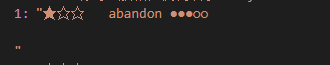

 ## 正则--字符串匹配利器

> 正则表达式是用于匹配字符串中字符组合的模式

正则表达式的字面量写法: 
```
const reg = //
```
#### 一. 在两条斜杠中书写规则
##### 1. 不变的内容直接写就好, 比如邮箱中的@
##### 2. "变化的内容"
|  表示法         | 意义       |  
|  -------| -------- -------- |
| \d | 数字(\为转义符)，也就是[0-9] |
| \w | 字母、数字、下划线，也就是[0-9a-z_]|
| \s | space(空白字符) |
|| *上面三个代表符号如果为大写字母 \D, \W, \S, 则表示取反*|
| [] | 一个字符(两种用法: [abc] 包含 a, b, c 中任意一个即可; [a-z] 范围, 也就是 26 个小写字母  |
| .  | 匹配除换行符 \n 外的所有字符
|([\d\D]*), ([\w\W]*), ([\s\S]*) | 匹配包含换行符的所有字符
|[\u4e00-\u9fa5]| 匹配中文字符 (不包括标点符号) |

*注意: txt 文件中换行符为(\r\n): 回车 (return 回到行首) 和换行 (newline 新起一行) 是两个动作, 使用\r\n会匹配到一行内容末尾到另一行行首*  
下图是使用 /(★☆☆.*)\r\n\r\n/ 匹配到的结果  


##### 3. 功能符号
- 量词  
|  符号         | 意义       |  
|  -------| -------- -------- |
|? | 零次或一次, 等同于 {0,1}   |
|* | 零次或更多(不推荐使用)  |
|+ | 一次或更多  |
|{数字} | 重复的次数, {5} 就是五次  |
|{最小值, 最大值} | 范围, 如 {1, 5}, 一到五次  |
|{最小值, } | 最小值至无限  |

```
var str = "★☆☆   time-consuming ●○○○○"
const reg = /.*/g
console.log(reg.exec(str));
//上面写法得到 str 全部内容; 使用 /\w*/g, 得到空字符串; 使用 /\w+/g 第一次得到 time, 第二次得到 consuming
//如果有前后边界, 那么用.*, 因为可能前后边界挨着, 中间没有内容; 如果是匹配内容, 就要用 .+, 否则匹配一个空字符串出来没有意义
```
- 其他功能符号  
|  符号         | 意义       |  
|  -------| -------- -------- |
| &#166; | 或   |
|()| 分组  |
| \\b | 单词边界  |
| \\B |  非单词边界  |
|^ |  出现在 [] 中时表示排除; 否则表示匹配的内容的开头必须出现在字符串的开头    |
|$ |  表示匹配的内容的结尾必须出现在字符串的结尾  |

疑问: 在 node 中使用时要用 \\\b

```
const str = ‘abcdabefg’ 
const reg = /ab/g
//使用 exec 方法可以匹配到两个, 加 ^ 可以匹配到一个, 加 $ 一个都匹配不到
``` 

- 附加在字面量 // 后的符号  
  - i: 忽略大小写  
  - g: 找到全部

### 正则表达式中使用变量
```
(1)
var fun = function(oldV, newV) {
  const regExp = new RegExp(`\\b${oldV}`, 'g');
  const str = 'xello yorld';
  return str.replace(regExp, newV)
}
fun('x', 'h') // 'hello yorld'
(2)
var fun = function(oldV, newV) {
  const regExp = eval(`/\\b${oldV}/g`);
  const str = 'xello yorld';
  return str.replace(regExp, newV)
}
fun('x', 'h') // 'hello yorld'


```

#### 二. 字符串方法 (参数为正则实例)
string.match(regexp)：提供内容  
string.search(regexp)：提供位置（索引，不存在为-1）  
string.replace(regexp, newValue)：替换匹配内容  
*注意: 由于正则的懒惰性 查找替换所有需要在后面加上g*

#### 三. 正则
**方法 (参数为字符串)**
regexp.test(string): 检验字符串是否符合要求

regexp.exec(string): 在一个指定字符串中执行一个搜索匹配。返回一个结果数组或 null。  
结果数组的第 0 项是与正则表达式相匹配的文本，第 1 个元素是第一个 () 内的规则匹配到的内容, 第二个元素是第二个 () 内的规则匹配到的内容, 以此类推...如果有量词, 如 (){5}, 则是最后一次, 也就是第五次匹配到的内容  
exec 方法每次只返回一个匹配, 需要循环执行; 如果不加 g, 每次返回的都是一样的结果, 加 g 才能依次返回所有匹配  
如果只是为了判断是否匹配 ( true 或 false)，可以使用 test() 方法，或者 search() 方法。

**属性**

RegExp.$1：指的是与正则表达式匹配 (使用 exec 方法后) 的第一个子匹配 (以括号为标志) 字符串  
regexp.lastIndex: 设置 exec 函数捕获的起点, 可以在函数第一次执行前就设置

**正则的贪婪与非贪婪模式**

如果首尾是确定的, 而中间有模糊匹配, 贪婪模式会尽可能多地重复匹配字符, 而非贪婪模式会尽可能少地重复匹配字符
```
const str = 'abcd1234cd'
const reg = /ab.*?cd/g
console.log(reg.exec(str));
```
上例为非贪婪模式, 返回结果:  


如果不要中间的问号, 就是贪婪模式, 返回结果:  


