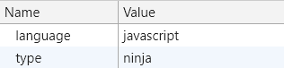

### 数据存储
#### 应用自身 - 程序外部存储/浏览器存储
js 代码是运行在内存中的， 代码运行时的所有变量， 函数， 也都是保存在内存中的。 刷新页面， 以前申请的内存被释放， 重新加载脚本代码， 变量重新赋值， 所以这些数据要想保留再用就必须储存在外部(浏览器中， 例如： localStorage, sessionStorage, IndexDB等

- **vuex**  
  vuex 中的数据刷新页面就会清空  
  可以在刷新时将其中的数据存储至 "外部"
  ```
  const store = new Vuex.Store({
    state:sessionStorage.getItem('state') ? JSON.parse(sessionStorage.getItem('state')): {
      //数据初始状态
    }
  })

  在主组件中:
  mounted(){
    window.addEventListener('unload', this.saveState)
  },
  methods: {
    saveState() {
        sessionStorage.setItem('state', JSON.stringify(this.$store.state))
    }
  }
  ```

#### 与服务端沟通
**涉及到浏览器与服务器沟通时, 特别注意同源策略. 可以通过 CORS 解决( CORS 是一个 W3C 标准，全称是"跨域资源共享"（Cross-origin resource sharing）**  
**跨域访问的项目常常需要在请求头和响应头中进行配置**
##### cookie  
  cookie的诞生: 由于HTTP协议是无状态的，而服务器端的业务必须是要有状态的。 cookie诞生的最初目的是为了存储 web 中的状态信息，以方便服务器端使用。比如判断用户是否是第一次访问网站。  
  **cookie 前后端都可以操作**  
  服务器可以要求客户端设置 cookie, 客户端会将其保存在 Application 下的 Cookies 中; 之后每次 http 请求浏览器都会将 cookie 发送给服务器端  
  ```js
  //前端配置
  axios.defaults.withCredentials = true
  //后端配置
  res.setHeader('Access-Control-Allow-Credentials', true)
  res.setHeader('Set-Cookie', ['type=ninja', 'language=javascript'])  
  ```
  浏览器 Application 下的 Cookies 中看到结果如下:  
  

  JavaScript 可以使用 document.cookie 属性来创建 、读取、及删除 cookie。这也是唯一可以操作cookie的属性
  ```js
  //设置与变更
  document.cookie = 'name = chen'
  document.cookie = 'age = 27'
  function setCookie(key, value, expires){
    var time = new Date()
    time.setTime(time.getTime() - 1000 * 60 * 60 * 8 + expires * 1000)
    document.cookie = `${key} = ${value}; expires = ${expires ? time : ''}`
  }
  setCookie('day', 'may', '10')

  //获取
  function getCookie(key){
    var value = ''
    var cookieArr = document.cookie.split('; ')
    cookieArr.forEach(item => {
      var tempArr = item.split('=')     
      if(tempArr[0] == key) value = tempArr[1]
    })    
    if(value) return value
    return '未找到目标cookie'
  }
  console.log(getCookie('day'))
  ```

##### sessionStorage  
  当前会话期有效, 关掉页面存储的数据会清空, 刷新页面不会

##### localStorage  
  无法设置有效期, 永久有效, 除非手动删除. (清楚缓存会清除存储的数据)  
  不同浏览器无法共享 localStorage, 相同浏览器的不同页面间可以共享相同的 localStorage (页面属于相同域名和端口)

##### indexedDB

##### jwt/json web token
**后端代码**
http://www.pangbo51.com/node/167.html  
```js
//配置跨域
res.setHeader('Access-Control-Allow-Headers', 'Authorization')
const method = req.method   
if(method == 'OPTIONS'){   
  return res.end()
} 
//生成 token
const jwt  = require('jsonwebtoken');
let payload = {name:'张三',admin:true};
let secret = 'I_LOVE_JING';
let token = jwt.sign(payload,secret); 
//token 可放在结果数据中一起返回给前端
//解码
let payload = jwt.verify(token, secret)
```

**前端代码**
```js
// 通过拦截器在响应头中添加 token 验证的 Authorization 字段
axios.interceptors.request.use(config => { 
  config.headers.Authorization = window.sessionStorage.getItem('token')
  //*发起登录请求的时候还没有token, window.sessionStorage.getItem('token')为"null"  
  return config
})

//设置路由导航守卫
router.beforeEach((to, from, next) => {
  if(to.path == "/login") return next()
  const token = window.sessionStorage.getItem("token")
  if(!token) return next("/login")
  next()
}) 
```          

**为请求头添加 Authorization 字段后, htpp 请求发送失败**
当在进行跨域请求的时候，如果自定义请求头，如添加 Authorization 字段，那么 HTTP 请求会发出一个预验 OPTIONS请求, 询问服务器是否允许该请求, 只有得到肯定答复, 浏览器才会正式发出 http 请求, 否则就报错. 因此, 后端代码中必须对 OPTIONS 请求进行处理


**文章与摘录**  
cookie、session、sessionStorage、localStorage 之间的区别及应用场景: https://segmentfault.com/a/1190000015804205

Access-Control-Allow- 设置 CORS: https://blog.csdn.net/u012501054/article/details/84519574

http 访问控制: https://developer.mozilla.org/zh-CN/docs/Web/HTTP/Access_control_CORS

请求头与响应头: http://www.voidcn.com/article/p-aaldeydj-bqq.html